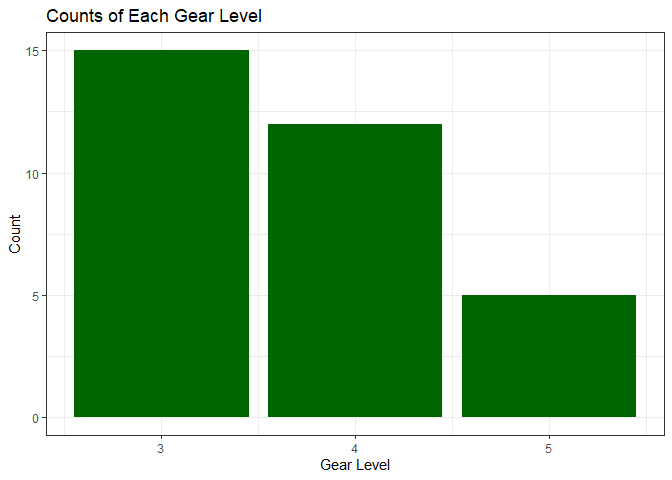

# Exercise 1.1 - Selected Countries in 1970s

-------------------------------------------------

<table class="table" style="margin-left: auto; margin-right: auto;">
<caption>Gapminder Data for Brazil, Canada, and Japan</caption>
 <thead>
  <tr>
   <th style="text-align:left;"> country </th>
   <th style="text-align:left;"> continent </th>
   <th style="text-align:right;"> year </th>
   <th style="text-align:right;"> lifeExp </th>
   <th style="text-align:right;"> pop </th>
   <th style="text-align:right;"> gdpPercap </th>
  </tr>
 </thead>
<tbody>
  <tr>
   <td style="text-align:left;"> Brazil </td>
   <td style="text-align:left;"> Americas </td>
   <td style="text-align:right;"> 1972 </td>
   <td style="text-align:right;"> 59.504 </td>
   <td style="text-align:right;"> 100840058 </td>
   <td style="text-align:right;"> 4985.711 </td>
  </tr>
  <tr>
   <td style="text-align:left;"> Brazil </td>
   <td style="text-align:left;"> Americas </td>
   <td style="text-align:right;"> 1977 </td>
   <td style="text-align:right;"> 61.489 </td>
   <td style="text-align:right;"> 114313951 </td>
   <td style="text-align:right;"> 6660.119 </td>
  </tr>
  <tr>
   <td style="text-align:left;"> Canada </td>
   <td style="text-align:left;"> Americas </td>
   <td style="text-align:right;"> 1972 </td>
   <td style="text-align:right;"> 72.880 </td>
   <td style="text-align:right;"> 22284500 </td>
   <td style="text-align:right;"> 18970.571 </td>
  </tr>
  <tr>
   <td style="text-align:left;"> Canada </td>
   <td style="text-align:left;"> Americas </td>
   <td style="text-align:right;"> 1977 </td>
   <td style="text-align:right;"> 74.210 </td>
   <td style="text-align:right;"> 23796400 </td>
   <td style="text-align:right;"> 22090.883 </td>
  </tr>
  <tr>
   <td style="text-align:left;"> Japan </td>
   <td style="text-align:left;"> Asia </td>
   <td style="text-align:right;"> 1972 </td>
   <td style="text-align:right;"> 73.420 </td>
   <td style="text-align:right;"> 107188273 </td>
   <td style="text-align:right;"> 14778.786 </td>
  </tr>
  <tr>
   <td style="text-align:left;"> Japan </td>
   <td style="text-align:left;"> Asia </td>
   <td style="text-align:right;"> 1977 </td>
   <td style="text-align:right;"> 75.380 </td>
   <td style="text-align:right;"> 113872473 </td>
   <td style="text-align:right;"> 16610.377 </td>
  </tr>
</tbody>
</table>

# Exercise 1.2 - Selected Countries and GDP Per Capita

-------------------------------------------------

<table class="table" style="margin-left: auto; margin-right: auto;">
<caption>GDP per Capita in the 1970s</caption>
 <thead>
  <tr>
   <th style="text-align:left;"> country </th>
   <th style="text-align:right;"> gdpPercap </th>
  </tr>
 </thead>
<tbody>
  <tr>
   <td style="text-align:left;"> Brazil </td>
   <td style="text-align:right;"> 4985.711 </td>
  </tr>
  <tr>
   <td style="text-align:left;"> Brazil </td>
   <td style="text-align:right;"> 6660.119 </td>
  </tr>
  <tr>
   <td style="text-align:left;"> Canada </td>
   <td style="text-align:right;"> 18970.571 </td>
  </tr>
  <tr>
   <td style="text-align:left;"> Canada </td>
   <td style="text-align:right;"> 22090.883 </td>
  </tr>
  <tr>
   <td style="text-align:left;"> Japan </td>
   <td style="text-align:right;"> 14778.786 </td>
  </tr>
  <tr>
   <td style="text-align:left;"> Japan </td>
   <td style="text-align:right;"> 16610.377 </td>
  </tr>
</tbody>
</table>

# Exercise 1.3 - Drop in Life Expectancy

-------------------------------------------------

<!--html_preserve--><div id="htmlwidget-982c7997794eded6851c" style="width:100%;height:auto;" class="datatables html-widget"></div>
<script type="application/json" data-for="htmlwidget-982c7997794eded6851c">{"x":{"filter":"none","data":[["1","2","3","4","5","6","7","8","9","10","11","12","13","14","15","16","17","18","19","20","21","22","23","24","25","26","27","28","29","30","31","32","33","34","35","36","37","38","39","40","41","42","43","44","45","46","47","48","49","50","51","52","53","54","55","56","57","58","59","60","61","62","63","64","65","66","67","68","69","70","71","72","73","74","75","76","77","78","79","80","81","82","83","84","85","86","87","88","89","90","91","92","93","94","95","96","97","98","99","100","101","102","103","104","105","106","107","108","109","110","111","112","113","114","115","116","117","118","119","120","121","122","123","124","125","126","127","128","129","130","131","132","133","134","135","136","137","138","139","140","141","142","143","144","145","146","147","148","149","150","151","152","153","154","155","156","157","158","159","160","161","162","163","164","165","166","167","168","169","170","171","172","173","174","175","176","177","178","179","180","181","182","183","184","185","186","187","188","189","190","191","192","193","194","195","196","197","198","199","200","201","202","203","204","205","206","207","208","209","210","211","212","213","214","215","216","217","218","219","220","221"],["Central African Republic","Somalia","India","Sierra Leone","Gabon","Djibouti","Oman","Angola","Benin","Burkina Faso","Yemen, Rep.","Mali","Mozambique","Jordan","Cote d'Ivoire","Bangladesh","Nicaragua","Guatemala","Equatorial Guinea","Madagascar","Tanzania","Guinea","Ghana","Syria","Senegal","Niger","China","Mongolia","Sudan","Algeria","Vietnam","Egypt","Rwanda","Pakistan","Comoros","Togo","Uganda","Morocco","West Bank and Gaza","Turkey","Kenya","Lesotho","Bahrain","Peru","Botswana","Indonesia","Gambia","El Salvador","Reunion","Congo, Dem. Rep.","Iran","Saudi Arabia","Iraq","Tunisia","Ethiopia","Ecuador","Philippines","Guinea-Bissau","Sri Lanka","Malawi","Kuwait","Colombia","Jamaica","Mexico","Lebanon","Venezuela","Cameroon","Zambia","Nigeria","Rwanda","Namibia","Korea, Rep.","Honduras","Hungary","Swaziland","Nepal","Cuba","Bolivia","Portugal","Eritrea","Taiwan","Slovak Republic","Romania","Italy","Austria","Mauritania","Puerto Rico","Zimbabwe","Israel","Burundi","Mauritius","Paraguay","Bulgaria","Uruguay","France","Bosnia and Herzegovina","Czech Republic","Switzerland","United States","Lesotho","Swaziland","Poland","New Zealand","Panama","Botswana","Cambodia","Japan","Hong Kong, China","Cambodia","Slovenia","Dominican Republic","Haiti","Montenegro","Namibia","South Africa","Zimbabwe","Chad","Australia","China","Botswana","Zambia","Myanmar","Denmark","Iraq","Liberia","Cambodia","Serbia","Kenya","Somalia","Zambia","Congo, Rep.","Swaziland","Uganda","Swaziland","Lesotho","Liberia","Korea, Dem. Rep.","Cote d'Ivoire","South Africa","Gabon","Burundi","Congo, Rep.","Kenya","Central African Republic","South Africa","Namibia","Congo, Dem. Rep.","Libya","Central African Republic","Uganda","Cote d'Ivoire","Malawi","Cameroon","Mozambique","Korea, Dem. Rep.","Rwanda","Cameroon","Lesotho","Tanzania","Zimbabwe","Mozambique","Malawi","Congo, Dem. Rep.","Iraq","Sierra Leone","Thailand","South Africa","El Salvador","Montenegro","Cote d'Ivoire","Tanzania","Central African Republic","Korea, Dem. Rep.","Chad","Zambia","Congo, Rep.","Zambia","Gabon","Botswana","Bulgaria","Nigeria","Iceland","Togo","Puerto Rico","Cameroon","Korea, Dem. Rep.","Uganda","Iraq","Eritrea","Slovak Republic","Hungary","Uganda","Trinidad and Tobago","Myanmar","Albania","Hungary","Trinidad and Tobago","Congo, Dem. Rep.","Benin","Poland","Jamaica","Croatia","Poland","Romania","Chad","Bulgaria","Serbia","Romania","Ghana","El Salvador","Bulgaria","Czech Republic","Norway","Netherlands","Denmark","Kenya","Angola","Gabon","Congo, Dem. Rep.","Nigeria","Jamaica"],[1952,1952,1952,1952,1952,1952,1952,1952,1952,1952,1952,1952,1952,1952,1952,1952,1952,1952,1952,1952,1952,1952,1952,1952,1952,1952,1952,1952,1952,1952,1952,1952,1952,1952,1952,1952,1952,1952,1952,1952,1952,1952,1952,1952,1952,1952,1952,1952,1952,1952,1952,1952,1952,1952,1952,1952,1952,1952,1952,1952,1952,1952,1952,1952,1952,1952,1952,1952,1952,1992,1952,1952,1952,1952,1952,1952,1952,1952,1952,1952,1952,1952,1952,1952,1952,1952,1952,1997,1952,1952,1952,1952,1952,1952,1952,1952,1952,1952,1952,2002,2002,1952,1952,1952,1997,1952,1952,1952,1977,1952,1952,1952,1952,2002,2002,2002,1952,1952,1962,2002,1997,1952,1952,1992,1992,1972,1952,1997,1992,1992,1952,2007,1997,1997,1997,1952,1952,1997,2007,2002,1992,1997,2002,1997,1952,1997,1997,1952,2002,1992,1992,2002,2002,2002,1997,1987,1997,2007,1997,1992,2007,1997,1992,2002,1992,1952,1997,1977,2002,2002,1992,1992,2002,2002,2002,1992,1987,1997,1992,1997,2002,1952,2002,1992,1992,1992,1977,1997,1982,1972,1982,1982,2002,2002,1992,1992,1997,1987,2002,1987,2002,1982,1977,1992,1997,1992,1982,1987,2002,1982,1977,1972,1987,1972,1982,1992,1987,2007,1982,1997,1992],[35.463,32.978,37.373,30.331,37.003,34.812,37.578,30.015,38.223,31.975,32.548,33.685,31.286,43.158,40.477,37.484,42.314,42.023,34.482,36.681,41.215,33.609,43.149,45.883,37.278,37.444,44,42.244,38.635,43.077,40.412,41.893,40,43.436,40.715,38.596,39.978,42.873,43.16,43.585,42.27,42.138,50.939,43.902,47.622,37.468,30,45.262,52.724,39.143,44.869,39.875,45.32,44.6,34.078,48.357,47.752,32.5,57.593,36.256,55.565,50.643,58.53,50.789,55.928,55.088,38.523,42.038,36.324,23.599,41.725,47.453,41.912,64.03,41.407,36.157,59.421,40.414,59.82,35.928,58.5,64.36,61.05,65.94,66.8,40.543,64.28,46.809,65.39,39.031,50.986,62.649,59.6,66.071,67.41,53.82,66.87,69.62,68.44,44.593,43.869,61.31,69.39,55.191,52.556,39.417,63.03,60.96,31.22,65.57,45.928,37.579,59.164,51.479,53.365,39.989,38.092,69.12,44.50136,46.634,40.238,36.319,70.78,59.461,40.802,40.317,57.996,54.407,39.658,46.1,42.111,39.613,44.578,54.289,55.558,38.48,50.056,47.991,49.339,56.761,44.736,52.962,50.992,46.066,45.009,58.909,42.587,42.723,43.308,48.825,52.044,45.009,49.856,44.026,67.727,44.02,52.199,42.592,48.466,60.377,42.082,47.495,45.548,57.046,38.333,50.848,60.236,56.696,73.981,46.832,50.44,49.396,66.662,50.525,39.193,56.433,50.821,60.461,62.745,70.32,46.608,72.49,57.561,73.911,54.314,69.978,50.35,58.811,43.89,70.35,69.39,49.849,68.976,59.908,71.581,69.17,69.465,47.412,54.406,70.98,72.047,70.46,70.67,69.36,51.573,71.19,70.162,69.53,58.453,56.604,70.81,70.29,75.89,73.75,74.63,59.285,39.906,56.735,47.784,47.464,71.766],[-45.19,-44.948,-44.384,-43.671,-43.654,-43.52,-42.618,-42.286,-41.218,-41.03,-40.874,-40.556,-39.878,-39.445,-38.305,-38.151,-37.89,-37.46,-37.396,-37.271,-37.185,-36.65,-36.257,-35.818,-35.499,-35.455,-34.553,-33.951,-33.761,-33.346,-33.335,-33.101,-32.476,-32.204,-32.174,-32.02,-31.799,-31.67,-31.089,-30.338,-30.265,-29.855,-28.89,-27.85,-27.23,-27.23,-26.735,-26.076,-26.022,-26.009,-25.781,-25.653,-25.644,-25.219,-23.962,-23.878,-23.669,-23.507,-23.348,-23.187,-23.058,-22.318,-22.016,-22.012,-21.66,-21.296,-21.2,-20.66,-20.543,-20.421,-20.344,-19.844,-19.004,-18.178,-17.149,-16.749,-16.327,-16.314,-15.743,-15.651,-15.643,-15.612,-15.392,-14.805,-14.435,-13.924,-13.818,-13.568,-13.495,-13.264,-13.178,-12.888,-12.79,-12.171,-11.903,-11.734,-11.403,-11.264,-10.985,-10.965,-10.42,-10.378,-10.372,-10.292,-10.189,-10.163,-9.53699999999999,-9.23799999999999,-9.097,-9.093,-8.863,-8.809,-7.639,-7.43,-6.871,-6.82,-6.649,-6.19999999999999,-6.0476,-5.922,-5.862,-5.763,-5.706,-5.583,-5.225,-5.098,-5.066,-4.878,-4.843,-4.721,-4.35100000000001,-4.256,-4.247,-4.185,-4.127,-4.112,-4.054,-4.053,-4.026,-3.7,-3.475,-3.471,-3.415,-3.33,-3.15,-3.09,-2.961,-2.955,-2.758,-2.684,-2.611,-2.486,-2.343,-2.318,-2.25099999999999,-2.198,-2.115,-2.001,-1.974,-1.974,-1.944,-1.925,-1.864,-1.765,-1.673,-1.669,-1.652,-1.511,-1.464,-1.159,-1.095,-1.089,-1.065,-1.048,-1.045,-1.037,-1,-0.905000000000001,-0.877000000000002,-0.870000000000005,-0.856000000000002,-0.847999999999999,-0.829000000000001,-0.718999999999994,-0.670999999999999,-0.669000000000011,-0.665999999999997,-0.649999999999999,-0.644999999999996,-0.63000000000001,-0.560000000000002,-0.501000000000005,-0.489000000000004,-0.420000000000002,-0.418999999999997,-0.409999999999997,-0.396999999999991,-0.372,-0.371000000000002,-0.339999999999989,-0.215000000000003,-0.180000000000007,-0.179999999999993,-0.170000000000002,-0.150999999999996,-0.150000000000006,-0.137999999999991,-0.129999999999995,-0.102999999999994,-0.0919999999999987,-0.0900000000000034,-0.0899999999999892,-0.0799999999999983,-0.0699999999999932,-0.0600000000000023,-0.054000000000002,-0.0360000000000014,-0.0260000000000034,-0.0200000000000031,-0.00800000000000267,-0.00399999999999068]],"container":"<table class=\"display\">\n  <thead>\n    <tr>\n      <th> <\/th>\n      <th>country<\/th>\n      <th>year<\/th>\n      <th>lifeExp<\/th>\n      <th>increaseinlifeExp<\/th>\n    <\/tr>\n  <\/thead>\n<\/table>","options":{"columnDefs":[{"className":"dt-right","targets":[2,3,4]},{"orderable":false,"targets":0}],"order":[],"autoWidth":false,"orderClasses":false}},"evals":[],"jsHooks":[]}</script><!--/html_preserve-->

# Exercise 1.4 - Max GDP Per Capita for Each Country

-------------------------------------------------

<!--html_preserve--><div id="htmlwidget-54701728921d99f5c279" style="width:100%;height:auto;" class="datatables html-widget"></div>
<script type="application/json" data-for="htmlwidget-54701728921d99f5c279">{"x":{"filter":"none","data":[["1","2","3","4","5","6","7","8","9","10","11","12","13","14","15","16","17","18","19","20","21","22","23","24","25","26","27","28","29","30","31","32","33","34","35","36","37","38","39","40","41","42","43","44","45","46","47","48","49","50","51","52","53","54","55","56","57","58","59","60","61","62","63","64","65","66","67","68","69","70","71","72","73","74","75","76","77","78","79","80","81","82","83","84","85","86","87","88","89","90","91","92","93","94","95","96","97","98","99","100","101","102","103","104","105","106","107","108","109","110","111","112","113","114","115","116","117","118","119","120","121","122","123","124","125","126","127","128","129","130","131","132","133","134","135","136","137","138","139","140","141","142"],["Afghanistan","Albania","Algeria","Angola","Argentina","Australia","Austria","Bahrain","Bangladesh","Belgium","Benin","Bolivia","Bosnia and Herzegovina","Botswana","Brazil","Bulgaria","Burkina Faso","Burundi","Cambodia","Cameroon","Canada","Central African Republic","Chad","Chile","China","Colombia","Comoros","Congo, Dem. Rep.","Congo, Rep.","Costa Rica","Cote d'Ivoire","Croatia","Cuba","Czech Republic","Denmark","Djibouti","Dominican Republic","Ecuador","Egypt","El Salvador","Equatorial Guinea","Eritrea","Ethiopia","Finland","France","Gabon","Gambia","Germany","Ghana","Greece","Guatemala","Guinea","Guinea-Bissau","Haiti","Honduras","Hong Kong, China","Hungary","Iceland","India","Indonesia","Iran","Iraq","Ireland","Israel","Italy","Jamaica","Japan","Jordan","Kenya","Korea, Dem. Rep.","Korea, Rep.","Kuwait","Lebanon","Lesotho","Liberia","Libya","Madagascar","Malawi","Malaysia","Mali","Mauritania","Mauritius","Mexico","Mongolia","Montenegro","Morocco","Mozambique","Myanmar","Namibia","Nepal","Netherlands","New Zealand","Nicaragua","Niger","Nigeria","Norway","Oman","Pakistan","Panama","Paraguay","Peru","Philippines","Poland","Portugal","Puerto Rico","Reunion","Romania","Rwanda","Sao Tome and Principe","Saudi Arabia","Senegal","Serbia","Sierra Leone","Singapore","Slovak Republic","Slovenia","Somalia","South Africa","Spain","Sri Lanka","Sudan","Swaziland","Sweden","Switzerland","Syria","Taiwan","Tanzania","Thailand","Togo","Trinidad and Tobago","Tunisia","Turkey","Uganda","United Kingdom","United States","Uruguay","Venezuela","Vietnam","West Bank and Gaza","Yemen, Rep.","Zambia","Zimbabwe"],[978.0114388,5937.029526,6223.367465,5522.776375,12779.37964,34435.36744,36126.4927,29796.04834,1391.253792,33692.60508,1441.284873,3822.137084,7446.298803,12569.85177,9065.800825,10680.79282,1217.032994,631.6998778,1713.778686,2602.664206,36319.23501,1193.068753,1704.063724,13171.63885,4959.114854,7006.580419,1937.577675,905.8602303,4879.507522,9645.06142,2602.710169,14619.22272,8948.102923,22833.30851,35278.41874,3694.212352,6025.374752,7429.455877,5581.180998,5728.353514,12154.08975,913.47079,690.8055759,33207.0844,30470.0167,21745.57328,884.7552507,32170.37442,1327.60891,27538.41188,5186.050003,945.5835837,838.1239671,2011.159549,3548.330846,39724.97867,18008.94444,36180.78919,2452.210407,3540.651564,11888.59508,14688.23507,40675.99635,25523.2771,28569.7197,7433.889293,31656.06806,4519.461171,1463.249282,4106.525293,23348.13973,113523.1329,10461.05868,1569.331442,803.0054535,21951.21176,1748.562982,759.3499101,12451.6558,1042.581557,1803.151496,10956.99112,11977.57496,3095.772271,11732.51017,3820.17523,823.6856205,944,4811.060429,1091.359778,36797.93332,25185.00911,5486.371089,1054.384891,2013.977305,49357.19017,22316.19287,2605.94758,9809.185636,4258.503604,7408.905561,3190.481016,15389.92468,20509.64777,19328.70901,7670.122558,10808.47561,881.5706467,1890.218117,34167.7626,1712.472136,15870.87851,1465.010784,47143.17964,18678.31435,25768.25759,1450.992513,9269.657808,28821.0637,3970.095407,2602.394995,4513.480643,33859.74835,37506.41907,4184.548089,28718.27684,1107.482182,7458.396327,1649.660188,18008.50924,7092.923025,8458.276384,1056.380121,33203.26128,42951.65309,10611.46299,13143.95095,2441.576404,7110.667619,2280.769906,1777.077318,799.3621758]],"container":"<table class=\"display\">\n  <thead>\n    <tr>\n      <th> <\/th>\n      <th>country<\/th>\n      <th>maxGdpPercap<\/th>\n    <\/tr>\n  <\/thead>\n<\/table>","options":{"columnDefs":[{"className":"dt-right","targets":2},{"orderable":false,"targets":0}],"order":[],"autoWidth":false,"orderClasses":false}},"evals":[],"jsHooks":[]}</script><!--/html_preserve-->


# Exercise 1.5 - Canada Life Expectancy vs GDP Per Capita

-------------------------------------------------

<!-- -->

# Exercise 2: Exploring a Quantitative Variable

-------------------------------------------------

<!--html_preserve--><div id="htmlwidget-7e50e23c01d99f5a7553" style="width:100%;height:auto;" class="datatables html-widget"></div>
<script type="application/json" data-for="htmlwidget-7e50e23c01d99f5a7553">{"x":{"filter":"none","data":[["1","2","3","4","5","6","7","8","9","10","11","12","13","14","15","16","17","18","19","20","21","22","23","24","25","26","27","28","29","30","31","32","33","34","35","36","37","38","39","40","41","42","43","44","45","46","47","48","49","50","51","52","53","54","55","56","57","58","59","60","61","62","63","64","65","66","67","68","69","70","71","72","73","74","75","76","77","78","79","80","81","82","83","84","85","86","87","88","89","90","91","92","93","94","95","96","97","98","99","100","101","102","103","104","105","106","107","108","109","110","111","112","113","114","115","116","117","118","119","120","121","122","123","124","125","126","127","128","129","130","131","132","133","134","135","136","137","138","139","140","141","142"],["Afghanistan","Albania","Algeria","Angola","Argentina","Australia","Austria","Bahrain","Bangladesh","Belgium","Benin","Bolivia","Bosnia and Herzegovina","Botswana","Brazil","Bulgaria","Burkina Faso","Burundi","Cambodia","Cameroon","Canada","Central African Republic","Chad","Chile","China","Colombia","Comoros","Congo, Dem. Rep.","Congo, Rep.","Costa Rica","Cote d'Ivoire","Croatia","Cuba","Czech Republic","Denmark","Djibouti","Dominican Republic","Ecuador","Egypt","El Salvador","Equatorial Guinea","Eritrea","Ethiopia","Finland","France","Gabon","Gambia","Germany","Ghana","Greece","Guatemala","Guinea","Guinea-Bissau","Haiti","Honduras","Hong Kong, China","Hungary","Iceland","India","Indonesia","Iran","Iraq","Ireland","Israel","Italy","Jamaica","Japan","Jordan","Kenya","Korea, Dem. Rep.","Korea, Rep.","Kuwait","Lebanon","Lesotho","Liberia","Libya","Madagascar","Malawi","Malaysia","Mali","Mauritania","Mauritius","Mexico","Mongolia","Montenegro","Morocco","Mozambique","Myanmar","Namibia","Nepal","Netherlands","New Zealand","Nicaragua","Niger","Nigeria","Norway","Oman","Pakistan","Panama","Paraguay","Peru","Philippines","Poland","Portugal","Puerto Rico","Reunion","Romania","Rwanda","Sao Tome and Principe","Saudi Arabia","Senegal","Serbia","Sierra Leone","Singapore","Slovak Republic","Slovenia","Somalia","South Africa","Spain","Sri Lanka","Sudan","Swaziland","Sweden","Switzerland","Syria","Taiwan","Tanzania","Thailand","Togo","Trinidad and Tobago","Tunisia","Turkey","Uganda","United Kingdom","United States","Uruguay","Venezuela","Vietnam","West Bank and Gaza","Yemen, Rep.","Zambia","Zimbabwe"],[8425333,1282697,9279525,4232095,17876956,8691212,6927772,120447,46886859,8730405,1738315,2883315,2791000,442308,56602560,7274900,4469979,2445618,4693836,5009067,14785584,1291695,2682462,6377619,556263527,12350771,153936,14100005,854885,926317,2977019,3882229,6007797,9125183,4334000,63149,2491346,3548753,22223309,2042865,192675,1438760,20860941,4090500,42459667,420702,284320,69145952,5581001,7733250,3146381,2664249,580653,3201488,1517453,2125900,9504000,147962,372000000,82052000,17272000,5441766,2830000,1620914,47666000,1426095,86459025,607914,6464046,8865488,20947571,160000,1439529,748747,863308,1019729,4762912,2917802,6748378,3838168,1022556,516556,30144317,800663,413834,9939217,6446316,20092996,485831,9182536,10381988,1994794,1165790,3379468,33119096,3327728,507833,41346560,940080,1555876,8025700,22438691,25730551,8526050,2227000,257700,16630000,2534927,60011,4005677,2755589,6860147,2143249,1127000,3558137,1489518,2526994,14264935,28549870,7982342,8504667,290243,7124673,4815000,3661549,8550362,8322925,21289402,1219113,662850,3647735,22235677,5824797,50430000,157553000,2252965,5439568,26246839,1030585,4963829,2672000,3080907],[31889923,3600523,33333216,12420476,40301927,20434176,8199783,708573,150448339,10392226,8078314,9119152,4552198,1639131,190010647,8971958,14326203,8390505,14131858,17696293,33390141,4369038,10238807,16284741,1318683096,44227550,710960,64606759,3800610,4133884,18013409,4494013,11416987,10315702,5468120,496374,9319622,13755680,80264543,6939688,551201,4906585,76511887,5238460,61083916,1454867,1688359,82400996,22873338,10706290,12572928,9947814,1472041,8502814,7483763,6980412,10705535,301931,1110396331,223547000,69453570,27499638,4109086,6426679,58147733,2780132,127467972,6053193,35610177,23301725,49044790,2505559,3921278,2046772,3193942,6036914,19167654,13327079,24821286,12031795,3270065,1250882,108700891,2874127,720230,33757175,19951656,47761980,2055080,28901790,16570613,4115771,5675356,12894865,135031164,4627926,3204897,169270617,3242173,6667147,28674757,91077287,38654957,10642836,3942491,798094,22797027,8860588,199579,27601038,12267493,10336594,6144562,4553009,5447502,2011612,9118773,44433622,40448191,20378239,42292929,1133066,9031088,7554661,19314747,23174294,38139640,65068149,5701579,1191336,10276158,71158647,29170398,60776238,301139947,3447496,26084662,85262356,4018332,22211743,11746035,12311143],[15823715.4166667,2580249.16666667,19875406.1666667,7309390.08333333,28602239.9166667,14649312.5,7583298.41666667,373913.166666667,90755395.3333333,9725118.66666667,4017496.66666667,5610395.16666667,3816524.75,971186.166666667,122312126.666667,8182985.33333333,7548677.25,4651608.33333333,8510430.66666667,9816648.41666667,24462967.3333333,2560963,5329256.33333333,11205725.3333333,958160051.916667,27256099.5833333,361683.916666667,32681655.25,1923209.08333333,2400007.75,9153109.5,4289916.25,9232575.5,9986262.83333333,4994187.33333333,260243.916666667,5735697.41666667,8212243.41666667,46522774.25,4343441.41666667,327551,2820216.83333333,41632518.75,4771321,52952564.3333333,795415.416666667,793138.583333333,77547043.3333333,12616626.4166667,9424181.08333333,6858694.75,5360550.66666667,882008.416666667,5401633.75,3920593.41666667,4792259.33333333,10217645.6666667,226978.083333333,701130739.833333,148322833.333333,42301706.8333333,14187495.1666667,3340825.91666667,3845610.75,54536958,2135122.83333333,111758808,2667972.75,18206250.1666667,16453881.25,36499386.3333333,1206495.58333333,2781846.41666667,1389696.41666667,1813857.16666667,3166803.58333333,9902402.16666667,7016377.41666667,14574055.3333333,7112340.08333333,1782723.83333333,926072.25,68414297.4166667,1734850.66666667,564269.666666667,20555741.9166667,12046695.3333333,33432292.5,1157849.75,16551744.5833333,13786797.9166667,3100032.16666667,3040975.16666667,6857373.83333333,73708017.8333333,4031441.08333333,1438205.33333333,93683385.75,1985290.25,3555485.91666667,17559093,52636628.5833333,34323304.4166667,9586273.91666667,3115178.25,518497.75,20819090.1666667,5298435.66666667,105977.833333333,12478368,6446305.41666667,8783886.75,3605424.91666667,2667817.41666667,4774507.08333333,1794381.41666667,5197197.83333333,29928352.1666667,35851798.4166667,14545831.75,21560331.4166667,679052,8220028.91666667,6384293.16666667,9865378.75,16874723.9166667,20499497.6666667,44961631.1666667,2895964,1006469.66666667,6686770.25,45909008.25,14361049.4166667,56087800.6666667,228211232.5,2912487.16666667,15129801.3333333,54568570.9166667,1848606.5,10843191.8333333,6353804.83333333,7641966.08333333],[13473708.5,2644572.5,18593278.5,6589529.5,28162601,14629150,7571521.5,337688.5,86751356,9839051.5,3404935,5360970,3952500,875909.5,121638445,8188141.5,6262085,4207412.5,7361545.5,8605348,24499150,2322252,4631689,11043452.5,971868000,26429528,326691,28563682.5,1655752,2266412,8242762.5,4366020.5,9663606,10195329.5,5103114.5,267342.5,5635574.5,7822358,42232837,4378729.5,281543,2574969.5,36364777.5,4782917.5,53799292,730120.5,661898.5,78248019.5,10969215.5,9547479.5,6049530,4468761.5,785607.5,5053476.5,3362341.5,4924100,10234053,227910,671000000,145034000,39276715,13028117,3375950,3677169.5,56297440.5,2227561.5,116163723.5,2142341.5,16080928,16986419,37881000,1279226,3088114.5,1331665.5,1808295.5,3032928.5,8589321.5,6070035.5,13643648.5,6744952.5,1539412,952532.5,67700440,1642016,561310.5,19297835.5,11857545.5,33104264.5,1038018,14864756,14081695,3187775,2767010.5,6059637,67624274.5,4078996,1152790.5,84807387,1938043.5,3175466.5,17057614,50153868,35424317.5,9761125,3179914.5,504952.5,21967326.5,5082318.5,92694.5,9691588.5,5704319,8859595.5,3302709.5,2488584.5,4937923,1804085.5,5091279,29134980.5,37211155,14763493.5,18736019.5,600663,8288454,6434763,8671498.5,17643293,18486973.5,46487722.5,2476673.5,1047808.5,6369579.5,44866412,12198579,56259352,226213417.5,2913758.5,14562164.5,53337843.5,1343483.5,9030804,5658478.5,7139315.5],[7114583.47431877,828585.541696081,8613355.34416447,2672280.58533307,7546608.98902828,3915202.96477682,437659.982043233,210893.261610458,34711660.6898279,520635.932944481,2105001.96175894,2082914.95811475,543112.830304604,471096.527435308,45747618.4416216,607579.740642304,3247807.8782713,1874538.36976197,3053246.42740448,4363640.08217063,5940792.54911187,1072158.02132259,2464303.84933866,3333125.56815429,264394872.832153,10535047.0825406,182998.737989915,16566210.8785384,975312.457178953,1090414.2027696,5283531.06779927,216541.175494985,1854709.94882138,394680.013303029,352059.869877097,154990.060305614,2291310.47426681,3549023.58331534,19665799.0824525,1575965.94889844,116418.759710561,1185915.90730692,18535274.2607566,358939.600382977,6086808.67851339,356404.480223207,466407.728330337,4341644.08617859,5776407.6434499,1036629.38108077,3062764.84177593,2504846.50405886,313291.696473679,1663698.25465651,1979896.30883261,1615040.80980002,354481.779779321,48541.6842170602,251724253.318421,49157535.9798074,19416535.6183242,7250266.74007816,428289.538843114,1610254.72964882,3601411.13391452,442525.830657238,14889878.3679787,1859372.86761121,9971073.26141502,5118303.79305865,9797922.5890673,783682.318609276,812785.196425505,488487.731897027,726030.430276337,1707794.24768689,4710772.17627521,3598828.08097054,5990940.32455119,2591012.75928382,737419.737732223,237493.395071076,26954820.6345337,729439.247637318,99737.9390059345,7919829.53949632,4457508.77239705,9626165.74592598,562803.034660541,6673251.07717592,2005630.56080464,654710.831920868,1528207.10802334,3094078.75142296,33876389.2275405,410795.489364556,909787.104334988,43052702.0260065,768969.5475213,1680388.6933833,7053307.63307065,22869649.4281032,4488220.09578177,681823.122248986,622713.273767328,171005.649117813,2165460.61209815,2181339.70217451,45906.1434665307,8374426.33387142,3195291.48338132,1192153.34758198,1270944.68612757,1090842.48103885,642509.591058157,202207.727442242,2159472.55533016,11304595.7024125,4323927.60225968,4158368.72844205,11295141.9501591,321256.623507523,636565.981839269,858200.909649508,5314789.43007301,4962817.65448233,10127002.9740614,15156143.0778651,1493490.51688337,165523.467481109,2370108.78692662,16677684.3290244,7532106.37385067,3174338.5628301,45790185.6356751,368526.988520721,7067984.9557457,20525848.2995544,1023056.73358621,5590408.43559827,3096948.73643177,3376895.17407311]],"container":"<table class=\"display\">\n  <thead>\n    <tr>\n      <th> <\/th>\n      <th>country<\/th>\n      <th>min_pop<\/th>\n      <th>max_pop<\/th>\n      <th>mean_pop<\/th>\n      <th>median_pop<\/th>\n      <th>sd_pop<\/th>\n    <\/tr>\n  <\/thead>\n<\/table>","options":{"columnDefs":[{"className":"dt-right","targets":[2,3,4,5,6]},{"orderable":false,"targets":0}],"order":[],"autoWidth":false,"orderClasses":false}},"evals":[],"jsHooks":[]}</script><!--/html_preserve-->

# Exercise 2: Exploring Categorical Variable

-------------------------------------------------

<!-- -->

<table class="table" style="margin-left: auto; margin-right: auto;">
<caption>No. of Countries in Each Continent</caption>
 <thead>
  <tr>
   <th style="text-align:left;"> continent </th>
   <th style="text-align:right;"> n </th>
  </tr>
 </thead>
<tbody>
  <tr>
   <td style="text-align:left;"> Africa </td>
   <td style="text-align:right;"> 52 </td>
  </tr>
  <tr>
   <td style="text-align:left;"> Americas </td>
   <td style="text-align:right;"> 25 </td>
  </tr>
  <tr>
   <td style="text-align:left;"> Asia </td>
   <td style="text-align:right;"> 33 </td>
  </tr>
  <tr>
   <td style="text-align:left;"> Europe </td>
   <td style="text-align:right;"> 30 </td>
  </tr>
  <tr>
   <td style="text-align:left;"> Oceania </td>
   <td style="text-align:right;"> 2 </td>
  </tr>
</tbody>
</table>


# Exercise 3: Scatterplot

-------------------------------------------------

<!-- -->


# Exercise 3: Bar Graph

-------------------------------------------------

<!-- -->


# Recycling

-------------------------------------------------


```r
filter(gapminder, country == c("Rwanda", "Afghanistan")) %>%
  kable(., format = "html", caption = "Gapminder Data for Rwanda and Afghanistan")%>%
  kable_styling()
```

<table class="table" style="margin-left: auto; margin-right: auto;">
<caption>Gapminder Data for Rwanda and Afghanistan</caption>
 <thead>
  <tr>
   <th style="text-align:left;"> country </th>
   <th style="text-align:left;"> continent </th>
   <th style="text-align:right;"> year </th>
   <th style="text-align:right;"> lifeExp </th>
   <th style="text-align:right;"> pop </th>
   <th style="text-align:right;"> gdpPercap </th>
  </tr>
 </thead>
<tbody>
  <tr>
   <td style="text-align:left;"> Afghanistan </td>
   <td style="text-align:left;"> Asia </td>
   <td style="text-align:right;"> 1957 </td>
   <td style="text-align:right;"> 30.332 </td>
   <td style="text-align:right;"> 9240934 </td>
   <td style="text-align:right;"> 820.8530 </td>
  </tr>
  <tr>
   <td style="text-align:left;"> Afghanistan </td>
   <td style="text-align:left;"> Asia </td>
   <td style="text-align:right;"> 1967 </td>
   <td style="text-align:right;"> 34.020 </td>
   <td style="text-align:right;"> 11537966 </td>
   <td style="text-align:right;"> 836.1971 </td>
  </tr>
  <tr>
   <td style="text-align:left;"> Afghanistan </td>
   <td style="text-align:left;"> Asia </td>
   <td style="text-align:right;"> 1977 </td>
   <td style="text-align:right;"> 38.438 </td>
   <td style="text-align:right;"> 14880372 </td>
   <td style="text-align:right;"> 786.1134 </td>
  </tr>
  <tr>
   <td style="text-align:left;"> Afghanistan </td>
   <td style="text-align:left;"> Asia </td>
   <td style="text-align:right;"> 1987 </td>
   <td style="text-align:right;"> 40.822 </td>
   <td style="text-align:right;"> 13867957 </td>
   <td style="text-align:right;"> 852.3959 </td>
  </tr>
  <tr>
   <td style="text-align:left;"> Afghanistan </td>
   <td style="text-align:left;"> Asia </td>
   <td style="text-align:right;"> 1997 </td>
   <td style="text-align:right;"> 41.763 </td>
   <td style="text-align:right;"> 22227415 </td>
   <td style="text-align:right;"> 635.3414 </td>
  </tr>
  <tr>
   <td style="text-align:left;"> Afghanistan </td>
   <td style="text-align:left;"> Asia </td>
   <td style="text-align:right;"> 2007 </td>
   <td style="text-align:right;"> 43.828 </td>
   <td style="text-align:right;"> 31889923 </td>
   <td style="text-align:right;"> 974.5803 </td>
  </tr>
  <tr>
   <td style="text-align:left;"> Rwanda </td>
   <td style="text-align:left;"> Africa </td>
   <td style="text-align:right;"> 1952 </td>
   <td style="text-align:right;"> 40.000 </td>
   <td style="text-align:right;"> 2534927 </td>
   <td style="text-align:right;"> 493.3239 </td>
  </tr>
  <tr>
   <td style="text-align:left;"> Rwanda </td>
   <td style="text-align:left;"> Africa </td>
   <td style="text-align:right;"> 1962 </td>
   <td style="text-align:right;"> 43.000 </td>
   <td style="text-align:right;"> 3051242 </td>
   <td style="text-align:right;"> 597.4731 </td>
  </tr>
  <tr>
   <td style="text-align:left;"> Rwanda </td>
   <td style="text-align:left;"> Africa </td>
   <td style="text-align:right;"> 1972 </td>
   <td style="text-align:right;"> 44.600 </td>
   <td style="text-align:right;"> 3992121 </td>
   <td style="text-align:right;"> 590.5807 </td>
  </tr>
  <tr>
   <td style="text-align:left;"> Rwanda </td>
   <td style="text-align:left;"> Africa </td>
   <td style="text-align:right;"> 1982 </td>
   <td style="text-align:right;"> 46.218 </td>
   <td style="text-align:right;"> 5507565 </td>
   <td style="text-align:right;"> 881.5706 </td>
  </tr>
  <tr>
   <td style="text-align:left;"> Rwanda </td>
   <td style="text-align:left;"> Africa </td>
   <td style="text-align:right;"> 1992 </td>
   <td style="text-align:right;"> 23.599 </td>
   <td style="text-align:right;"> 7290203 </td>
   <td style="text-align:right;"> 737.0686 </td>
  </tr>
  <tr>
   <td style="text-align:left;"> Rwanda </td>
   <td style="text-align:left;"> Africa </td>
   <td style="text-align:right;"> 2002 </td>
   <td style="text-align:right;"> 43.413 </td>
   <td style="text-align:right;"> 7852401 </td>
   <td style="text-align:right;"> 785.6538 </td>
  </tr>
</tbody>
</table>

The result produced was not what the author intended. Instead of filtering all the rows with "Rwanda" and "Afghanistan", they only pulled out 12 rows. 6 rows for "Afghanistan" and 6 rows for "Rwanda". This is incorrect because if we look at the year column, we can see that it does not capture all the data. This can be verified by looking at the year data that gapminder contains (code below). We can see that it contains data from the year 1952 to 2007 in intervals of 5. Therefore, this shows that the code above does not capture all the data expected.


```r
unique(gapminder$year)
```

```
##  [1] 1952 1957 1962 1967 1972 1977 1982 1987 1992 1997 2002 2007
```

What is happening here is that R is looking at the vector "country" and recycling the conditions, "Rwanda" and then "Afghanistan." Since the first condition is "Rwanda", it first appears in 1952. Then, the second condition is Afghanistan, and this appears next in 1957. It does not look at Afghanistan in 1952 because the countries are sorted alphabetically from A-Z. Essentially, since "Rwanda" is the first condition, R will look for when "Rwanda" first appears, which is in 1952. The next time "Afghanistan" appears is in 1957. These two conditions are recycled over and over again until all the rows containing "Rwanda" and "Afghanistan" is printed. The final row printed is "Afghanistan" in 2007 because if R tries to recycle "Rwanda" and "Afghanistan" again, it would only be able to output "Rwanda" in 2007 but nothing else for "Afghanistan" since there is no more data after 2007. 


# My Fix 

----------------------

To fix the code, here is one proposed solution which outputs 24 rows. This can be verified to be correct by looking at the year column to see if it starts in 1952 and jumps in intervals of 5 until 2007 for only "Rwanda" and "Afghanistan". 

```r
myfix <- gapminder %>%
          filter(country == "Rwanda" | country == "Afghanistan")
          
datatable(myfix)  
```

<!--html_preserve--><div id="htmlwidget-c3f6b26aa96f2a04bbe1" style="width:100%;height:auto;" class="datatables html-widget"></div>
<script type="application/json" data-for="htmlwidget-c3f6b26aa96f2a04bbe1">{"x":{"filter":"none","data":[["1","2","3","4","5","6","7","8","9","10","11","12","13","14","15","16","17","18","19","20","21","22","23","24"],["Afghanistan","Afghanistan","Afghanistan","Afghanistan","Afghanistan","Afghanistan","Afghanistan","Afghanistan","Afghanistan","Afghanistan","Afghanistan","Afghanistan","Rwanda","Rwanda","Rwanda","Rwanda","Rwanda","Rwanda","Rwanda","Rwanda","Rwanda","Rwanda","Rwanda","Rwanda"],["Asia","Asia","Asia","Asia","Asia","Asia","Asia","Asia","Asia","Asia","Asia","Asia","Africa","Africa","Africa","Africa","Africa","Africa","Africa","Africa","Africa","Africa","Africa","Africa"],[1952,1957,1962,1967,1972,1977,1982,1987,1992,1997,2002,2007,1952,1957,1962,1967,1972,1977,1982,1987,1992,1997,2002,2007],[28.801,30.332,31.997,34.02,36.088,38.438,39.854,40.822,41.674,41.763,42.129,43.828,40,41.5,43,44.1,44.6,45,46.218,44.02,23.599,36.087,43.413,46.242],[8425333,9240934,10267083,11537966,13079460,14880372,12881816,13867957,16317921,22227415,25268405,31889923,2534927,2822082,3051242,3451079,3992121,4657072,5507565,6349365,7290203,7212583,7852401,8860588],[779.4453145,820.8530296,853.10071,836.1971382,739.9811058,786.11336,978.0114388,852.3959448,649.3413952,635.341351,726.7340548,974.5803384,493.3238752,540.2893983,597.4730727,510.9637142,590.5806638,670.0806011,881.5706467,847.991217,737.0685949,589.9445051,785.6537648,863.0884639]],"container":"<table class=\"display\">\n  <thead>\n    <tr>\n      <th> <\/th>\n      <th>country<\/th>\n      <th>continent<\/th>\n      <th>year<\/th>\n      <th>lifeExp<\/th>\n      <th>pop<\/th>\n      <th>gdpPercap<\/th>\n    <\/tr>\n  <\/thead>\n<\/table>","options":{"columnDefs":[{"className":"dt-right","targets":[3,4,5,6]},{"orderable":false,"targets":0}],"order":[],"autoWidth":false,"orderClasses":false}},"evals":[],"jsHooks":[]}</script><!--/html_preserve-->

