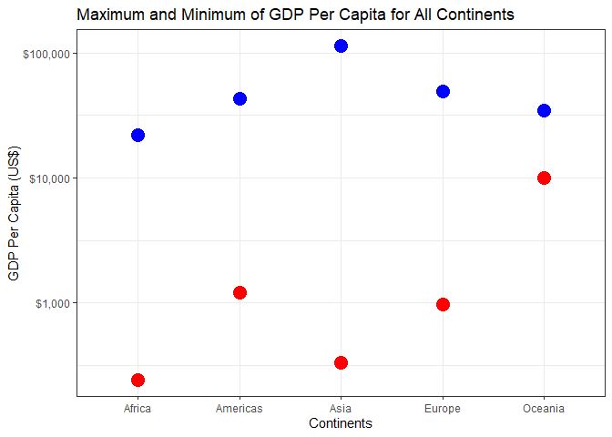
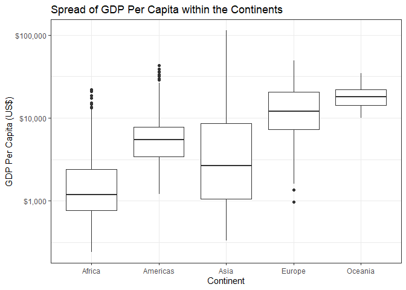

# Task Option 2 and 3: Maximum and Minimum of GDP Per Capita for All Continents and Spread of GDP Per Capita within the Continents 

<table class="table" style="margin-left: auto; margin-right: auto;">
<caption>Min, Max, Mean and SD of GDP Per 
  Capita for All Continents</caption>
 <thead>
  <tr>
   <th style="text-align:left;"> continent </th>
   <th style="text-align:right;"> Min </th>
   <th style="text-align:right;"> Max </th>
   <th style="text-align:right;"> Mean </th>
   <th style="text-align:right;"> SD </th>
  </tr>
 </thead>
<tbody>
  <tr>
   <td style="text-align:left;"> Africa </td>
   <td style="text-align:right;"> 241.1659 </td>
   <td style="text-align:right;"> 21951.21 </td>
   <td style="text-align:right;"> 2193.755 </td>
   <td style="text-align:right;"> 2827.930 </td>
  </tr>
  <tr>
   <td style="text-align:left;"> Americas </td>
   <td style="text-align:right;"> 1201.6372 </td>
   <td style="text-align:right;"> 42951.65 </td>
   <td style="text-align:right;"> 7136.110 </td>
   <td style="text-align:right;"> 6396.764 </td>
  </tr>
  <tr>
   <td style="text-align:left;"> Asia </td>
   <td style="text-align:right;"> 331.0000 </td>
   <td style="text-align:right;"> 113523.13 </td>
   <td style="text-align:right;"> 7902.150 </td>
   <td style="text-align:right;"> 14045.373 </td>
  </tr>
  <tr>
   <td style="text-align:left;"> Europe </td>
   <td style="text-align:right;"> 973.5332 </td>
   <td style="text-align:right;"> 49357.19 </td>
   <td style="text-align:right;"> 14469.476 </td>
   <td style="text-align:right;"> 9355.213 </td>
  </tr>
  <tr>
   <td style="text-align:left;"> Oceania </td>
   <td style="text-align:right;"> 10039.5956 </td>
   <td style="text-align:right;"> 34435.37 </td>
   <td style="text-align:right;"> 18621.609 </td>
   <td style="text-align:right;"> 6358.983 </td>
  </tr>
</tbody>
</table>

<!-- -->

 
# Task 4: Compute a Trimmed Mean of Life Expectancy for Different Years

<table class="table" style="margin-left: auto; margin-right: auto;">
<caption>Trimmed Mean of Life Expectancy for 
  Different Years</caption>
 <thead>
  <tr>
   <th style="text-align:right;"> year </th>
   <th style="text-align:right;"> Mean </th>
  </tr>
 </thead>
<tbody>
  <tr>
   <td style="text-align:right;"> 1952 </td>
   <td style="text-align:right;"> 49.05762 </td>
  </tr>
  <tr>
   <td style="text-align:right;"> 1957 </td>
   <td style="text-align:right;"> 51.50740 </td>
  </tr>
  <tr>
   <td style="text-align:right;"> 1962 </td>
   <td style="text-align:right;"> 53.60925 </td>
  </tr>
  <tr>
   <td style="text-align:right;"> 1967 </td>
   <td style="text-align:right;"> 55.67829 </td>
  </tr>
  <tr>
   <td style="text-align:right;"> 1972 </td>
   <td style="text-align:right;"> 57.64739 </td>
  </tr>
  <tr>
   <td style="text-align:right;"> 1977 </td>
   <td style="text-align:right;"> 59.57016 </td>
  </tr>
  <tr>
   <td style="text-align:right;"> 1982 </td>
   <td style="text-align:right;"> 61.53320 </td>
  </tr>
  <tr>
   <td style="text-align:right;"> 1987 </td>
   <td style="text-align:right;"> 63.21261 </td>
  </tr>
  <tr>
   <td style="text-align:right;"> 1992 </td>
   <td style="text-align:right;"> 64.16034 </td>
  </tr>
  <tr>
   <td style="text-align:right;"> 1997 </td>
   <td style="text-align:right;"> 65.01468 </td>
  </tr>
  <tr>
   <td style="text-align:right;"> 2002 </td>
   <td style="text-align:right;"> 65.69492 </td>
  </tr>
  <tr>
   <td style="text-align:right;"> 2007 </td>
   <td style="text-align:right;"> 67.00742 </td>
  </tr>
</tbody>
</table>

<!-- -->

