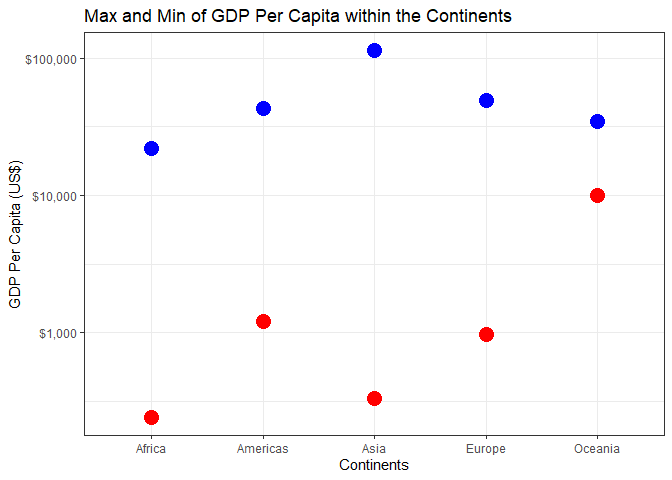
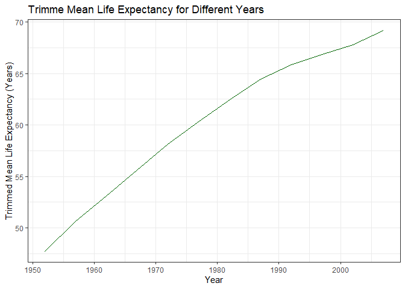
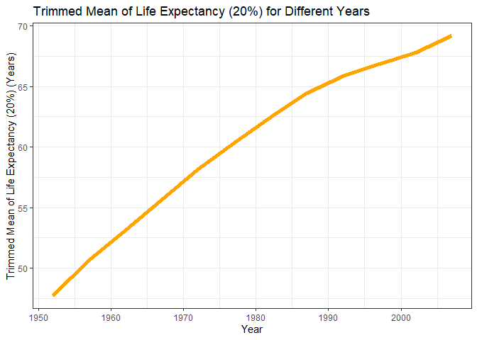

<style type="text/css">
.twoC {width: 100%}
.clearer {clear: both}
.twoC .table {max-width: 50%; float: left}
.twoC img {max-width: 49%; float: right}
</style>
<!-- Code derived from https://gist.github.com/jennybc/e9e9aba6ba18c72cec26#file-2015-03-02_plot-next-to-table-rmd Allows for putting figures and tables side-by-side -->


##### **Task Option 2: Max and Min GDP Per Capita within the Continents**

---------------------


```r
table1 <- gapminder %>%
            group_by(continent) %>%
            summarize(Min = min(gdpPercap), Max = max(gdpPercap)) %>%
            kable(., format = "html", caption = 
            "Max and Min GDP Per Capita within the Continents") %>%
            kable_styling()
```
<!-- Putting the table into a variable called table1 so we can print it out later side-by-side with the figure -->


```r
fig1 <- gapminder %>%
          group_by(continent) %>%
          summarize(Min = min(gdpPercap), Max = max(gdpPercap)) %>%
          ggplot(., aes(continent, Min))+
          geom_point(color = "red", size = 5)+
          geom_point(aes(continent, Max), color = "blue", size = 5)+
          scale_y_log10("GDP Per Capita (US$)", 
          labels = scales::dollar_format())+
          xlab("Continents")+
          ggtitle("Max and Min of GDP Per Capita within the Continents")+
          theme_bw()
```
<!-- Putting the figure into a variable called fig1 so we can print it out later side-by-side with the table -->

<div class="twoC">
<table class="table" style="margin-left: auto; margin-right: auto;">
<caption>Max and Min GDP Per Capita within the Continents</caption>
 <thead>
  <tr>
   <th style="text-align:left;"> continent </th>
   <th style="text-align:right;"> Min </th>
   <th style="text-align:right;"> Max </th>
  </tr>
 </thead>
<tbody>
  <tr>
   <td style="text-align:left;"> Africa </td>
   <td style="text-align:right;"> 241.1659 </td>
   <td style="text-align:right;"> 21951.21 </td>
  </tr>
  <tr>
   <td style="text-align:left;"> Americas </td>
   <td style="text-align:right;"> 1201.6372 </td>
   <td style="text-align:right;"> 42951.65 </td>
  </tr>
  <tr>
   <td style="text-align:left;"> Asia </td>
   <td style="text-align:right;"> 331.0000 </td>
   <td style="text-align:right;"> 113523.13 </td>
  </tr>
  <tr>
   <td style="text-align:left;"> Europe </td>
   <td style="text-align:right;"> 973.5332 </td>
   <td style="text-align:right;"> 49357.19 </td>
  </tr>
  <tr>
   <td style="text-align:left;"> Oceania </td>
   <td style="text-align:right;"> 10039.5956 </td>
   <td style="text-align:right;"> 34435.37 </td>
  </tr>
</tbody>
</table>

<!-- -->
</div>
<div class="clearer"></div>
<!-- Printing table 1 and figure 1 side-by-side -->

The table and figure above shows the minimum and maximum GDP Per Capita within each continent. Red represents the minimum GDP Per Capita. Blue represents the maximum GDP Per Capita. GDP Per Capita is on a log10 scale. The figure above shows that Africa has the smallest minimum GDP Per Capita compared to the minimum GDP Per Capita of other other continents. In terms of maximum GDP Per Capita, Asia has the largest maximum GDP Per Capita compared to the other continents. 

##### **Task Option 3: Spread of GDP Per Capita Within the Continents** 

---------------------


```r
table2 <- gapminder %>%
            group_by(continent) %>%
            summarize(median = median(gdpPercap), SD = sd(gdpPercap),  
            MedAbsdev = mad(gdpPercap), InQuartRange = IQR(gdpPercap)) %>%
            kable(., format = "html", caption = 
            "Spread of GDP Per Capita Within the Continents")%>%
            kable_styling(full_width = F)
```
<!-- Putting the table into a variable called table2 so we can print it out later side-by-side with the figure. Full_width compresses the columns together.-->


```r
fig2 <- gapminder %>%
          group_by(continent) %>%
          ggplot(., aes(continent, gdpPercap))+
          geom_boxplot()+
          scale_y_continuous("GDP Per Capita (US$)", 
          labels = scales::dollar_format())+
          xlab("Continent")+
          ggtitle("Spread of GDP Per Capita within the Continents")+
          theme_bw()
```
<!-- Putting the boxplot figure into a variable called fig2 so we can print it out later side-by-side with the table -->

<div class = "twoC">
<table class="table" style="width: auto !important; margin-left: auto; margin-right: auto;">
<caption>Spread of GDP Per Capita Within the Continents</caption>
 <thead>
  <tr>
   <th style="text-align:left;"> continent </th>
   <th style="text-align:right;"> median </th>
   <th style="text-align:right;"> SD </th>
   <th style="text-align:right;"> MedAbsdev </th>
   <th style="text-align:right;"> InQuartRange </th>
  </tr>
 </thead>
<tbody>
  <tr>
   <td style="text-align:left;"> Africa </td>
   <td style="text-align:right;"> 1192.138 </td>
   <td style="text-align:right;"> 2827.930 </td>
   <td style="text-align:right;"> 775.3226 </td>
   <td style="text-align:right;"> 1616.170 </td>
  </tr>
  <tr>
   <td style="text-align:left;"> Americas </td>
   <td style="text-align:right;"> 5465.510 </td>
   <td style="text-align:right;"> 6396.764 </td>
   <td style="text-align:right;"> 3269.3325 </td>
   <td style="text-align:right;"> 4402.431 </td>
  </tr>
  <tr>
   <td style="text-align:left;"> Asia </td>
   <td style="text-align:right;"> 2646.787 </td>
   <td style="text-align:right;"> 14045.373 </td>
   <td style="text-align:right;"> 2820.8338 </td>
   <td style="text-align:right;"> 7492.262 </td>
  </tr>
  <tr>
   <td style="text-align:left;"> Europe </td>
   <td style="text-align:right;"> 12081.749 </td>
   <td style="text-align:right;"> 9355.213 </td>
   <td style="text-align:right;"> 8846.0506 </td>
   <td style="text-align:right;"> 13248.301 </td>
  </tr>
  <tr>
   <td style="text-align:left;"> Oceania </td>
   <td style="text-align:right;"> 17983.304 </td>
   <td style="text-align:right;"> 6358.983 </td>
   <td style="text-align:right;"> 6459.1033 </td>
   <td style="text-align:right;"> 8072.258 </td>
  </tr>
</tbody>
</table>

<!-- -->
</div>
<div class="clearer"></div>
<!-- Printing table 2 and figure 2 side-by-side -->

The table and figure above shows the spread of GDP Per Capita within each continent using a boxplot. I calculated the median, standard deviation (SD), median absolute deviation (MedAbsDev) and the interquartile range (InQuartRange) and this is seen in the table. From both the table and figure, we can see that Asia has the largest spread of GDP Per Capita compared to the other continents. In contrast, we can see from both the table and figure that Africa has the smallest spread of GPD Per Capita compared to the other continents. Also to note, a log10 scale was not applied to the Y axis. This is because it resulted in the inability to visualize and appreciate the spread of GDP Per Capita within each continent. 


##### **Task 4 Option: Compute a Trimmed Mean of Life Expectancy for Different Years**

---------------------


```r
table3 <- gapminder %>%
            arrange(year) %>%
            group_by(year) %>%
            summarize(Mean = mean(lifeExp, trim = 0.2)) %>%
            kable(., format = "html", caption = 
            "Trimmed Mean of Life Expectancy for Different Years") %>%
            kable_styling()
```
<!-- Putting the table into a variable called table3 so we can print it out later side-by-side with the figure. Trimming 0.2 of observations from each end.  -->


```r
fig3 <- gapminder %>%
          arrange(year) %>%
          group_by(year) %>%
          summarize(mean = mean(lifeExp, trim = 0.2)) %>%
          ggplot(., aes(year, mean))+
          geom_line(color = "dark green")+
          xlab("Year")+
          ylab("Trimmed Mean Life (20%) Expectancy (Years)")+
          ggtitle("Trimmed Mean Life (20%) Expectancy for Different Years")+
          theme_bw()
```
<!-- Putting the figure into a variable called fig3 so we can print it out later side-by-side with the table -->

<div class = "twoC">
<table class="table" style="margin-left: auto; margin-right: auto;">
<caption>Trimmed Mean of Life Expectancy for Different Years</caption>
 <thead>
  <tr>
   <th style="text-align:right;"> year </th>
   <th style="text-align:right;"> Mean </th>
  </tr>
 </thead>
<tbody>
  <tr>
   <td style="text-align:right;"> 1952 </td>
   <td style="text-align:right;"> 47.74866 </td>
  </tr>
  <tr>
   <td style="text-align:right;"> 1957 </td>
   <td style="text-align:right;"> 50.64422 </td>
  </tr>
  <tr>
   <td style="text-align:right;"> 1962 </td>
   <td style="text-align:right;"> 53.12857 </td>
  </tr>
  <tr>
   <td style="text-align:right;"> 1967 </td>
   <td style="text-align:right;"> 55.63999 </td>
  </tr>
  <tr>
   <td style="text-align:right;"> 1972 </td>
   <td style="text-align:right;"> 58.12370 </td>
  </tr>
  <tr>
   <td style="text-align:right;"> 1977 </td>
   <td style="text-align:right;"> 60.38896 </td>
  </tr>
  <tr>
   <td style="text-align:right;"> 1982 </td>
   <td style="text-align:right;"> 62.47444 </td>
  </tr>
  <tr>
   <td style="text-align:right;"> 1987 </td>
   <td style="text-align:right;"> 64.48383 </td>
  </tr>
  <tr>
   <td style="text-align:right;"> 1992 </td>
   <td style="text-align:right;"> 65.89072 </td>
  </tr>
  <tr>
   <td style="text-align:right;"> 1997 </td>
   <td style="text-align:right;"> 66.84437 </td>
  </tr>
  <tr>
   <td style="text-align:right;"> 2002 </td>
   <td style="text-align:right;"> 67.77385 </td>
  </tr>
  <tr>
   <td style="text-align:right;"> 2007 </td>
   <td style="text-align:right;"> 69.17224 </td>
  </tr>
</tbody>
</table>

<!-- -->
</div>
<div class="clearer"></div>
<!-- Printing table 3 and figure 3 side-by-side -->

The table and figure above shows how a trimmed mean of life expectancy changes from year-to-year. I have a chosen a trim fraction of 0.2 (20%). From both the table and figure, we can see that as the years increase, the trimmed mean life expectancy also increases.


