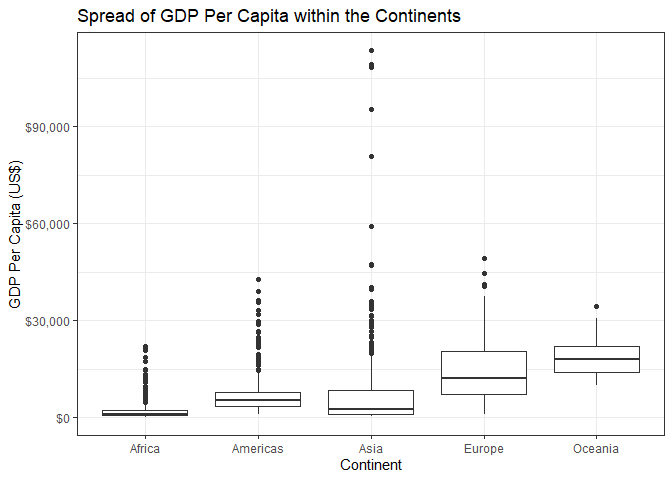

<!-- Code derived from https://gist.github.com/jennybc/e9e9aba6ba18c72cec26#file-2015-03-02_plot-next-to-table-rmd -->

##### **Task Option 2: Max and Min GDP Per Capita within the Continents**

---------------------

<table class="table" style="width: auto !important; margin-left: auto; margin-right: auto;">
<caption>Min and Max GDP Per Capita within the
  Continents</caption>
 <thead>
  <tr>
   <th style="text-align:left;"> continent </th>
   <th style="text-align:right;"> Min </th>
   <th style="text-align:right;"> Max </th>
  </tr>
 </thead>
<tbody>
  <tr>
   <td style="text-align:left;"> Africa </td>
   <td style="text-align:right;"> 241.1659 </td>
   <td style="text-align:right;"> 21951.21 </td>
  </tr>
  <tr>
   <td style="text-align:left;"> Americas </td>
   <td style="text-align:right;"> 1201.6372 </td>
   <td style="text-align:right;"> 42951.65 </td>
  </tr>
  <tr>
   <td style="text-align:left;"> Asia </td>
   <td style="text-align:right;"> 331.0000 </td>
   <td style="text-align:right;"> 113523.13 </td>
  </tr>
  <tr>
   <td style="text-align:left;"> Europe </td>
   <td style="text-align:right;"> 973.5332 </td>
   <td style="text-align:right;"> 49357.19 </td>
  </tr>
  <tr>
   <td style="text-align:left;"> Oceania </td>
   <td style="text-align:right;"> 10039.5956 </td>
   <td style="text-align:right;"> 34435.37 </td>
  </tr>
</tbody>
</table>

<!-- -->

The table and figure above shows the minimum and maximum GDP Per Capita within each continent from all the years recorded. Red represents the minimum GDP Per Capita. Blue represents the maximum GDP Per Capita. This graph shows that Africa has the smallest minimum GDP Per Capita compared to the minimum GDP Per Capita of other other continents. In terms of maximum GDP Per Capita, Asia has the largest maximum GDP Per Capita compared to the other continents. 

##### **Task Option 3: Spread of GDP Per Capita Within the Continents** 

---------------------

<table class="table" style="width: auto !important; margin-left: auto; margin-right: auto;">
<caption>Spread of GDP Per Capita Within the Continents</caption>
 <thead>
  <tr>
   <th style="text-align:left;"> continent </th>
   <th style="text-align:right;"> median </th>
   <th style="text-align:right;"> SD </th>
   <th style="text-align:right;"> MedAbsdev </th>
   <th style="text-align:right;"> InQuartRange </th>
  </tr>
 </thead>
<tbody>
  <tr>
   <td style="text-align:left;"> Africa </td>
   <td style="text-align:right;"> 1192.138 </td>
   <td style="text-align:right;"> 2827.930 </td>
   <td style="text-align:right;"> 775.3226 </td>
   <td style="text-align:right;"> 1616.170 </td>
  </tr>
  <tr>
   <td style="text-align:left;"> Americas </td>
   <td style="text-align:right;"> 5465.510 </td>
   <td style="text-align:right;"> 6396.764 </td>
   <td style="text-align:right;"> 3269.3325 </td>
   <td style="text-align:right;"> 4402.431 </td>
  </tr>
  <tr>
   <td style="text-align:left;"> Asia </td>
   <td style="text-align:right;"> 2646.787 </td>
   <td style="text-align:right;"> 14045.373 </td>
   <td style="text-align:right;"> 2820.8338 </td>
   <td style="text-align:right;"> 7492.262 </td>
  </tr>
  <tr>
   <td style="text-align:left;"> Europe </td>
   <td style="text-align:right;"> 12081.749 </td>
   <td style="text-align:right;"> 9355.213 </td>
   <td style="text-align:right;"> 8846.0506 </td>
   <td style="text-align:right;"> 13248.301 </td>
  </tr>
  <tr>
   <td style="text-align:left;"> Oceania </td>
   <td style="text-align:right;"> 17983.304 </td>
   <td style="text-align:right;"> 6358.983 </td>
   <td style="text-align:right;"> 6459.1033 </td>
   <td style="text-align:right;"> 8072.258 </td>
  </tr>
</tbody>
</table>

<!-- -->

The table and figure above shows the spread of GDP Per Capita within each continent using a boxplot. GDP Per Capita is on a log10 scale. From the figure we can see that Asia had the largest spread of GDP Per Capita. In contrast, Africa had the smallest spread of GPD Per Capita. 

##### **Task 4: Compute a Trimmed Mean of Life Expectancy for Different Years**

---------------------

<table class="table" style="margin-left: auto; margin-right: auto;">
<caption>Trimmed Mean of Life Expectancy 
  for Different Years</caption>
 <thead>
  <tr>
   <th style="text-align:right;"> year </th>
   <th style="text-align:right;"> Mean </th>
  </tr>
 </thead>
<tbody>
  <tr>
   <td style="text-align:right;"> 1952 </td>
   <td style="text-align:right;"> 47.74866 </td>
  </tr>
  <tr>
   <td style="text-align:right;"> 1957 </td>
   <td style="text-align:right;"> 50.64422 </td>
  </tr>
  <tr>
   <td style="text-align:right;"> 1962 </td>
   <td style="text-align:right;"> 53.12857 </td>
  </tr>
  <tr>
   <td style="text-align:right;"> 1967 </td>
   <td style="text-align:right;"> 55.63999 </td>
  </tr>
  <tr>
   <td style="text-align:right;"> 1972 </td>
   <td style="text-align:right;"> 58.12370 </td>
  </tr>
  <tr>
   <td style="text-align:right;"> 1977 </td>
   <td style="text-align:right;"> 60.38896 </td>
  </tr>
  <tr>
   <td style="text-align:right;"> 1982 </td>
   <td style="text-align:right;"> 62.47444 </td>
  </tr>
  <tr>
   <td style="text-align:right;"> 1987 </td>
   <td style="text-align:right;"> 64.48383 </td>
  </tr>
  <tr>
   <td style="text-align:right;"> 1992 </td>
   <td style="text-align:right;"> 65.89072 </td>
  </tr>
  <tr>
   <td style="text-align:right;"> 1997 </td>
   <td style="text-align:right;"> 66.84437 </td>
  </tr>
  <tr>
   <td style="text-align:right;"> 2002 </td>
   <td style="text-align:right;"> 67.77385 </td>
  </tr>
  <tr>
   <td style="text-align:right;"> 2007 </td>
   <td style="text-align:right;"> 69.17224 </td>
  </tr>
</tbody>
</table>

<!-- -->

The table and figure above shows a trimmed mean of life expectancy among countries in different years. I have a chosen a trim fraction of 0.2 (20%). From both the table and figure, we can see that as the years increase, the trimmed mean life expectancy also increases. 
