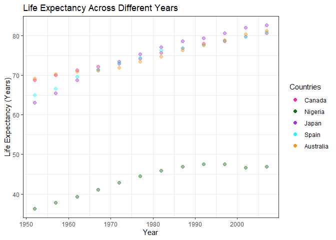

```r
library(gapminder)
library(tidyverse)
library(DT)
library(knitr)
```
# **Exercise 1: Univariate Data Reshaping**

------------------------------

## **Univariate Option 1.1 - Putting Data in Wider Format: Life Expectancy** 

```r
gapminder %>%
  filter(country == "Canada" | country == "Nigeria" | country == "Japan" | 
        country == "Spain" | country == "Australia") %>%
  pivot_wider(id_cols = year,
              names_from = country,
              values_from = lifeExp) %>%
  knitr::kable()
```


 year   Australia   Canada    Japan   Nigeria    Spain
-----  ----------  -------  -------  --------  -------
 1952      69.120   68.750   63.030    36.324   64.940
 1957      70.330   69.960   65.500    37.802   66.660
 1962      70.930   71.300   68.730    39.360   69.690
 1967      71.100   72.130   71.430    41.040   71.440
 1972      71.930   72.880   73.420    42.821   73.060
 1977      73.490   74.210   75.380    44.514   74.390
 1982      74.740   75.760   77.110    45.826   76.300
 1987      76.320   76.860   78.670    46.886   76.900
 1992      77.560   77.950   79.360    47.472   77.570
 1997      78.830   78.610   80.690    47.464   78.770
 2002      80.370   79.770   82.000    46.608   79.780
 2007      81.235   80.653   82.603    46.859   80.941

First, I filtered the gapminder data set to select the following countries: Australia, Canada,  Japan, Nigeria and Spain. One country was chosen from each continent. Next, I used the pivot_wider function to put the life expectancy data for all five countries into a wider format. This makes it easier to compare the life expectancy between all five countries across the different years. From this table, we can see that some countries will have similar life expectancies. For example, Australia, Canada and Spain shared similar life expectancies in 1992.

## **Univariate Option 1.2 - Scatterplot of Wide Data**

```r
gapminder %>%
  filter(country == "Canada" | country == "Nigeria" | country == "Japan" | 
        country == "Spain" | country == "Australia") %>%
  pivot_wider(id_cols = year,
              names_from = country,
              values_from = lifeExp) %>%
  ggplot(aes(year, Canada, color = "deeppink"))+
  geom_point(size = 2, alpha = 0.4)+
  geom_point(aes(year, Nigeria, color = "dark green"),  size = 2, alpha = 0.4)+
  geom_point(aes(year, Japan, color = "purple"),  size = 2, alpha = 0.4)+
  geom_point(aes(year, Spain, color = "cyan"),  size = 2, alpha = 0.4)+
  geom_point(aes(year, Australia, color = "dark orange"),  size = 2, alpha = 0.4)+
  scale_colour_identity(name = "Countries",
                        breaks = c("deeppink", "dark green", "purple", "cyan", "dark orange"),
                        labels = c("Canada", "Nigeria", "Japan", "Spain", "Australia"),
                        guide = "legend") +
  xlab("Year")+
  ylab("Life Expectancy (Years)")+
  ggtitle("Life Expectancy Across Different Years")+
  theme_bw()
```

<!-- -->

I plotted a scatterplot of the Life Expectancy versus Year for the 5 countries I have selected. The alpha function was used to help visualize and differentiate points of overlap. **Pink** represents **Canada**, **Green** represents **Nigeria**, **Purple** represents **Japan**, **Cyan** represents **Spain**, and **Orange** represents **Australia**. We can see that across all the years, Nigeria has the lowest life expectancy compared to all the other countries. In contrast, Canada, Japan, Spain and Australia had comparable life expectancies from 1967 and onwards with Japan having the highest life expectancy in the more recent years. 

## **Univariate Option 1.3 - Relengthening the Data**

```r
gapminder %>%
  filter(country == "Canada" | country == "Nigeria" | country == "Japan" | 
        country == "Spain" | country == "Australia") %>%
  pivot_wider(id_cols = year,
              names_from = country,
              values_from = lifeExp) %>%
  pivot_longer(cols = c("Australia", "Canada", "Japan", "Nigeria", "Spain"),
              names_to = "country",
              values_to = "lifeExp") %>%
  arrange(country) %>%
  knitr::kable()
```


 year  country      lifeExp
-----  ----------  --------
 1952  Australia     69.120
 1957  Australia     70.330
 1962  Australia     70.930
 1967  Australia     71.100
 1972  Australia     71.930
 1977  Australia     73.490
 1982  Australia     74.740
 1987  Australia     76.320
 1992  Australia     77.560
 1997  Australia     78.830
 2002  Australia     80.370
 2007  Australia     81.235
 1952  Canada        68.750
 1957  Canada        69.960
 1962  Canada        71.300
 1967  Canada        72.130
 1972  Canada        72.880
 1977  Canada        74.210
 1982  Canada        75.760
 1987  Canada        76.860
 1992  Canada        77.950
 1997  Canada        78.610
 2002  Canada        79.770
 2007  Canada        80.653
 1952  Japan         63.030
 1957  Japan         65.500
 1962  Japan         68.730
 1967  Japan         71.430
 1972  Japan         73.420
 1977  Japan         75.380
 1982  Japan         77.110
 1987  Japan         78.670
 1992  Japan         79.360
 1997  Japan         80.690
 2002  Japan         82.000
 2007  Japan         82.603
 1952  Nigeria       36.324
 1957  Nigeria       37.802
 1962  Nigeria       39.360
 1967  Nigeria       41.040
 1972  Nigeria       42.821
 1977  Nigeria       44.514
 1982  Nigeria       45.826
 1987  Nigeria       46.886
 1992  Nigeria       47.472
 1997  Nigeria       47.464
 2002  Nigeria       46.608
 2007  Nigeria       46.859
 1952  Spain         64.940
 1957  Spain         66.660
 1962  Spain         69.690
 1967  Spain         71.440
 1972  Spain         73.060
 1977  Spain         74.390
 1982  Spain         76.300
 1987  Spain         76.900
 1992  Spain         77.570
 1997  Spain         78.770
 2002  Spain         79.780
 2007  Spain         80.941

I used the pivot_longer function after the pivot_wider function to re-lengthen the data. Then I used the kable function to produce a table.

# **Exercise 2: Multivariate Data Reshaping**

--------------------------------------------

## **Multivariate Option 1.1**

```r
gapminder %>%
  filter(country == "Japan" | country == "China" | country == "Thailand" | 
        country == "Malaysia" | country == "Singapore") %>%
  pivot_wider(id_cols = year,
              names_from = country,
              names_sep = "_",
              values_from = c(lifeExp, gdpPercap)) %>%
  knitr::kable()
```


 year   lifeExp_China   lifeExp_Japan   lifeExp_Malaysia   lifeExp_Singapore   lifeExp_Thailand   gdpPercap_China   gdpPercap_Japan   gdpPercap_Malaysia   gdpPercap_Singapore   gdpPercap_Thailand
-----  --------------  --------------  -----------------  ------------------  -----------------  ----------------  ----------------  -------------------  --------------------  -------------------
 1952        44.00000          63.030             48.463              60.396             50.848          400.4486          3216.956             1831.133              2315.138             757.7974
 1957        50.54896          65.500             52.102              63.179             53.630          575.9870          4317.694             1810.067              2843.104             793.5774
 1962        44.50136          68.730             55.737              65.798             56.061          487.6740          6576.649             2036.885              3674.736            1002.1992
 1967        58.38112          71.430             59.371              67.946             58.285          612.7057          9847.789             2277.742              4977.419            1295.4607
 1972        63.11888          73.420             63.010              69.521             60.405          676.9001         14778.786             2849.095              8597.756            1524.3589
 1977        63.96736          75.380             65.256              70.795             62.494          741.2375         16610.377             3827.922             11210.089            1961.2246
 1982        65.52500          77.110             68.000              71.760             64.597          962.4214         19384.106             4920.356             15169.161            2393.2198
 1987        67.27400          78.670             69.500              73.560             66.084         1378.9040         22375.942             5249.803             18861.531            2982.6538
 1992        68.69000          79.360             70.693              75.788             67.298         1655.7842         26824.895             7277.913             24769.891            4616.8965
 1997        70.42600          80.690             71.938              77.158             67.521         2289.2341         28816.585            10132.910             33519.477            5852.6255
 2002        72.02800          82.000             73.044              78.770             68.564         3119.2809         28604.592            10206.978             36023.105            5913.1875
 2007        72.96100          82.603             74.241              79.972             70.616         4959.1149         31656.068            12451.656             47143.180            7458.3963

First, I filtered out the following countries from the gapminder data set: Japan, China, Thailand, Malaysia, and Singapore. Next, I used the pivot wider function to create separate columns for the Life Expectancy and GDP Per Capita for each country. Then I used the kable function to produce a table. Putting the data in a wider format makes it easier for us to compare the life expectancy and GDP Per Capita between all these countries across different years.

## **Multivariate Option 1.2**

```r
gapminder %>%
  filter(country == "Japan" | country == "China" | country == "Thailand" | 
        country == "Malaysia" | country == "Singapore") %>%
  pivot_wider(id_cols = year,
              names_from = country,
              names_sep = "_",
              values_from = c(lifeExp, gdpPercap))%>%
  pivot_longer(cols = -year,
               names_to = c(".value", "country"),
               names_sep = "_",
               values_to = c("lifeExp", "gdpPercap")) %>%
               arrange(country) %>%
  knitr::kable()
```


 year  country       lifeExp    gdpPercap
-----  ----------  ---------  -----------
 1952  China        44.00000     400.4486
 1957  China        50.54896     575.9870
 1962  China        44.50136     487.6740
 1967  China        58.38112     612.7057
 1972  China        63.11888     676.9001
 1977  China        63.96736     741.2375
 1982  China        65.52500     962.4214
 1987  China        67.27400    1378.9040
 1992  China        68.69000    1655.7842
 1997  China        70.42600    2289.2341
 2002  China        72.02800    3119.2809
 2007  China        72.96100    4959.1149
 1952  Japan        63.03000    3216.9563
 1957  Japan        65.50000    4317.6944
 1962  Japan        68.73000    6576.6495
 1967  Japan        71.43000    9847.7886
 1972  Japan        73.42000   14778.7864
 1977  Japan        75.38000   16610.3770
 1982  Japan        77.11000   19384.1057
 1987  Japan        78.67000   22375.9419
 1992  Japan        79.36000   26824.8951
 1997  Japan        80.69000   28816.5850
 2002  Japan        82.00000   28604.5919
 2007  Japan        82.60300   31656.0681
 1952  Malaysia     48.46300    1831.1329
 1957  Malaysia     52.10200    1810.0670
 1962  Malaysia     55.73700    2036.8849
 1967  Malaysia     59.37100    2277.7424
 1972  Malaysia     63.01000    2849.0948
 1977  Malaysia     65.25600    3827.9216
 1982  Malaysia     68.00000    4920.3560
 1987  Malaysia     69.50000    5249.8027
 1992  Malaysia     70.69300    7277.9128
 1997  Malaysia     71.93800   10132.9096
 2002  Malaysia     73.04400   10206.9779
 2007  Malaysia     74.24100   12451.6558
 1952  Singapore    60.39600    2315.1382
 1957  Singapore    63.17900    2843.1044
 1962  Singapore    65.79800    3674.7356
 1967  Singapore    67.94600    4977.4185
 1972  Singapore    69.52100    8597.7562
 1977  Singapore    70.79500   11210.0895
 1982  Singapore    71.76000   15169.1611
 1987  Singapore    73.56000   18861.5308
 1992  Singapore    75.78800   24769.8912
 1997  Singapore    77.15800   33519.4766
 2002  Singapore    78.77000   36023.1054
 2007  Singapore    79.97200   47143.1796
 1952  Thailand     50.84800     757.7974
 1957  Thailand     53.63000     793.5774
 1962  Thailand     56.06100    1002.1992
 1967  Thailand     58.28500    1295.4607
 1972  Thailand     60.40500    1524.3589
 1977  Thailand     62.49400    1961.2246
 1982  Thailand     64.59700    2393.2198
 1987  Thailand     66.08400    2982.6538
 1992  Thailand     67.29800    4616.8965
 1997  Thailand     67.52100    5852.6255
 2002  Thailand     68.56400    5913.1875
 2007  Thailand     70.61600    7458.3963

I used the pivot_longer function to re-lengthen the tibble I previously widened. Then I used the kable function to produce a table.

# **Exercise 3: Table Joins**

---------------------------

## **Exercise 3.1:** 

```r
guest <- read_csv("https://raw.githubusercontent.com/STAT545-UBC/Classroom/master/data/wedding/attend.csv")
email <- read_csv("https://raw.githubusercontent.com/STAT545-UBC/Classroom/master/data/wedding/emails.csv")
```


```r
email2 <- email %>%
  rename("name" = "guest") %>%
  separate_rows (name, sep = ", ")

guest %>% 
  left_join(email2, by = "name") %>%
  knitr::kable()
```


 party  name                 meal_wedding   meal_brunch   attendance_wedding   attendance_brunch   attendance_golf   email                        
------  -------------------  -------------  ------------  -------------------  ------------------  ----------------  -----------------------------
     1  Sommer Medrano       PENDING        PENDING       PENDING              PENDING             PENDING           sommm@gmail.com              
     1  Phillip Medrano      vegetarian     Menu C        CONFIRMED            CONFIRMED           CONFIRMED         sommm@gmail.com              
     1  Blanka Medrano       chicken        Menu A        CONFIRMED            CONFIRMED           CONFIRMED         sommm@gmail.com              
     1  Emaan Medrano        PENDING        PENDING       PENDING              PENDING             PENDING           sommm@gmail.com              
     2  Blair Park           chicken        Menu C        CONFIRMED            CONFIRMED           CONFIRMED         bpark@gmail.com              
     2  Nigel Webb           NA             NA            CANCELLED            CANCELLED           CANCELLED         bpark@gmail.com              
     3  Sinead English       PENDING        PENDING       PENDING              PENDING             PENDING           singlish@hotmail.ca          
     4  Ayra Marks           vegetarian     Menu B        PENDING              PENDING             PENDING           marksa42@gmail.com           
     5  Atlanta Connolly     PENDING        PENDING       PENDING              PENDING             PENDING           NA                           
     5  Denzel Connolly      fish           Menu B        CONFIRMED            CONFIRMED           CONFIRMED         NA                           
     5  Chanelle Shah        chicken        Menu C        CONFIRMED            CONFIRMED           CONFIRMED         NA                           
     6  Jolene Welsh         NA             NA            CANCELLED            CANCELLED           CANCELLED         jw1987@hotmail.com           
     6  Hayley Booker        vegetarian     Menu C        CONFIRMED            CONFIRMED           CONFIRMED         jw1987@hotmail.com           
     7  Amayah Sanford       NA             PENDING       CANCELLED            PENDING             PENDING           erikaaaaaa@gmail.com         
     7  Erika Foley          PENDING        PENDING       PENDING              PENDING             PENDING           erikaaaaaa@gmail.com         
     8  Ciaron Acosta        PENDING        Menu A        PENDING              PENDING             PENDING           shining_ciaron@gmail.com     
     9  Diana Stuart         vegetarian     Menu C        CONFIRMED            CONFIRMED           CONFIRMED         doodledianastu@gmail.com     
    10  Cosmo Dunkley        PENDING        PENDING       PENDING              PENDING             PENDING           NA                           
    11  Cai Mcdaniel         fish           Menu C        CONFIRMED            CONFIRMED           CONFIRMED         NA                           
    12  Daisy-May Caldwell   chicken        Menu B        CONFIRMED            CONFIRMED           CONFIRMED         caldwellfamily5212@gmail.com 
    12  Martin Caldwell      PENDING        PENDING       PENDING              PENDING             PENDING           caldwellfamily5212@gmail.com 
    12  Violet Caldwell      PENDING        PENDING       PENDING              PENDING             PENDING           caldwellfamily5212@gmail.com 
    12  Nazifa Caldwell      chicken        PENDING       PENDING              PENDING             PENDING           caldwellfamily5212@gmail.com 
    12  Eric Caldwell        chicken        Menu B        CONFIRMED            CONFIRMED           CONFIRMED         caldwellfamily5212@gmail.com 
    13  Rosanna Bird         vegetarian     Menu C        CONFIRMED            CONFIRMED           CONFIRMED         rosy1987b@gmail.com          
    13  Kurtis Frost         PENDING        PENDING       PENDING              PENDING             PENDING           rosy1987b@gmail.com          
    14  Huma Stokes          NA             NA            CANCELLED            CANCELLED           CANCELLED         humastokes@gmail.com         
    14  Samuel Rutledge      chicken        Menu C        CONFIRMED            CONFIRMED           CONFIRMED         humastokes@gmail.com         
    15  Eddison Collier      PENDING        PENDING       PENDING              PENDING             PENDING           eddison.collier@gmail.com    
    15  Stewart Nicholls     chicken        Menu B        CONFIRMED            CONFIRMED           CONFIRMED         eddison.collier@gmail.com    

In the email tibble, I renamed the column "guest" to "name" so that it can joined afterwards with the guest tibble which also has a column titled "name." I then transformed the email tibble to display individual names along with their respective email addresses. This was done because the original format of the email tibble has the names grouped up to a single email address. After ungrouping the names and email addresses, I assigned this newly formatted tibble to the variable "email2." Finally, I used the left_join function to add the email column to the guest tibble. This results in an email column being added to the guestlist. 


## **Exercise 3.2**

```r
anti_join(email2, guest) %>%
  knitr::kable()
```

```
## Joining, by = "name"
```


name              email                           
----------------  --------------------------------
Turner Jones      tjjones12@hotmail.ca            
Albert Marshall   themarshallfamily1234@gmail.com 
Vivian Marshall   themarshallfamily1234@gmail.com 

I used the email2 tibble since this displayed all the names individually with their respective email address. Next, I used the anti_join function to filter out who we have emails for but are not on the guestlist. 

## **Exercise 3.3**

```r
full_join(email2, guest) %>%
  knitr::kable()
```

```
## Joining, by = "name"
```


name                 email                              party  meal_wedding   meal_brunch   attendance_wedding   attendance_brunch   attendance_golf 
-------------------  --------------------------------  ------  -------------  ------------  -------------------  ------------------  ----------------
Sommer Medrano       sommm@gmail.com                        1  PENDING        PENDING       PENDING              PENDING             PENDING         
Phillip Medrano      sommm@gmail.com                        1  vegetarian     Menu C        CONFIRMED            CONFIRMED           CONFIRMED       
Blanka Medrano       sommm@gmail.com                        1  chicken        Menu A        CONFIRMED            CONFIRMED           CONFIRMED       
Emaan Medrano        sommm@gmail.com                        1  PENDING        PENDING       PENDING              PENDING             PENDING         
Blair Park           bpark@gmail.com                        2  chicken        Menu C        CONFIRMED            CONFIRMED           CONFIRMED       
Nigel Webb           bpark@gmail.com                        2  NA             NA            CANCELLED            CANCELLED           CANCELLED       
Sinead English       singlish@hotmail.ca                    3  PENDING        PENDING       PENDING              PENDING             PENDING         
Ayra Marks           marksa42@gmail.com                     4  vegetarian     Menu B        PENDING              PENDING             PENDING         
Jolene Welsh         jw1987@hotmail.com                     6  NA             NA            CANCELLED            CANCELLED           CANCELLED       
Hayley Booker        jw1987@hotmail.com                     6  vegetarian     Menu C        CONFIRMED            CONFIRMED           CONFIRMED       
Amayah Sanford       erikaaaaaa@gmail.com                   7  NA             PENDING       CANCELLED            PENDING             PENDING         
Erika Foley          erikaaaaaa@gmail.com                   7  PENDING        PENDING       PENDING              PENDING             PENDING         
Ciaron Acosta        shining_ciaron@gmail.com               8  PENDING        Menu A        PENDING              PENDING             PENDING         
Diana Stuart         doodledianastu@gmail.com               9  vegetarian     Menu C        CONFIRMED            CONFIRMED           CONFIRMED       
Daisy-May Caldwell   caldwellfamily5212@gmail.com          12  chicken        Menu B        CONFIRMED            CONFIRMED           CONFIRMED       
Martin Caldwell      caldwellfamily5212@gmail.com          12  PENDING        PENDING       PENDING              PENDING             PENDING         
Violet Caldwell      caldwellfamily5212@gmail.com          12  PENDING        PENDING       PENDING              PENDING             PENDING         
Nazifa Caldwell      caldwellfamily5212@gmail.com          12  chicken        PENDING       PENDING              PENDING             PENDING         
Eric Caldwell        caldwellfamily5212@gmail.com          12  chicken        Menu B        CONFIRMED            CONFIRMED           CONFIRMED       
Rosanna Bird         rosy1987b@gmail.com                   13  vegetarian     Menu C        CONFIRMED            CONFIRMED           CONFIRMED       
Kurtis Frost         rosy1987b@gmail.com                   13  PENDING        PENDING       PENDING              PENDING             PENDING         
Huma Stokes          humastokes@gmail.com                  14  NA             NA            CANCELLED            CANCELLED           CANCELLED       
Samuel Rutledge      humastokes@gmail.com                  14  chicken        Menu C        CONFIRMED            CONFIRMED           CONFIRMED       
Eddison Collier      eddison.collier@gmail.com             15  PENDING        PENDING       PENDING              PENDING             PENDING         
Stewart Nicholls     eddison.collier@gmail.com             15  chicken        Menu B        CONFIRMED            CONFIRMED           CONFIRMED       
Turner Jones         tjjones12@hotmail.ca                  NA  NA             NA            NA                   NA                  NA              
Albert Marshall      themarshallfamily1234@gmail.com       NA  NA             NA            NA                   NA                  NA              
Vivian Marshall      themarshallfamily1234@gmail.com       NA  NA             NA            NA                   NA                  NA              
Atlanta Connolly     NA                                     5  PENDING        PENDING       PENDING              PENDING             PENDING         
Denzel Connolly      NA                                     5  fish           Menu B        CONFIRMED            CONFIRMED           CONFIRMED       
Chanelle Shah        NA                                     5  chicken        Menu C        CONFIRMED            CONFIRMED           CONFIRMED       
Cosmo Dunkley        NA                                    10  PENDING        PENDING       PENDING              PENDING             PENDING         
Cai Mcdaniel         NA                                    11  fish           Menu C        CONFIRMED            CONFIRMED           CONFIRMED       

Using the email2 tibble that separates all the names and email addresses into individual rows, I then used the full_join function to make a guestlist that includes everyone we have emails for (in addition to those on the original guestlist). 


