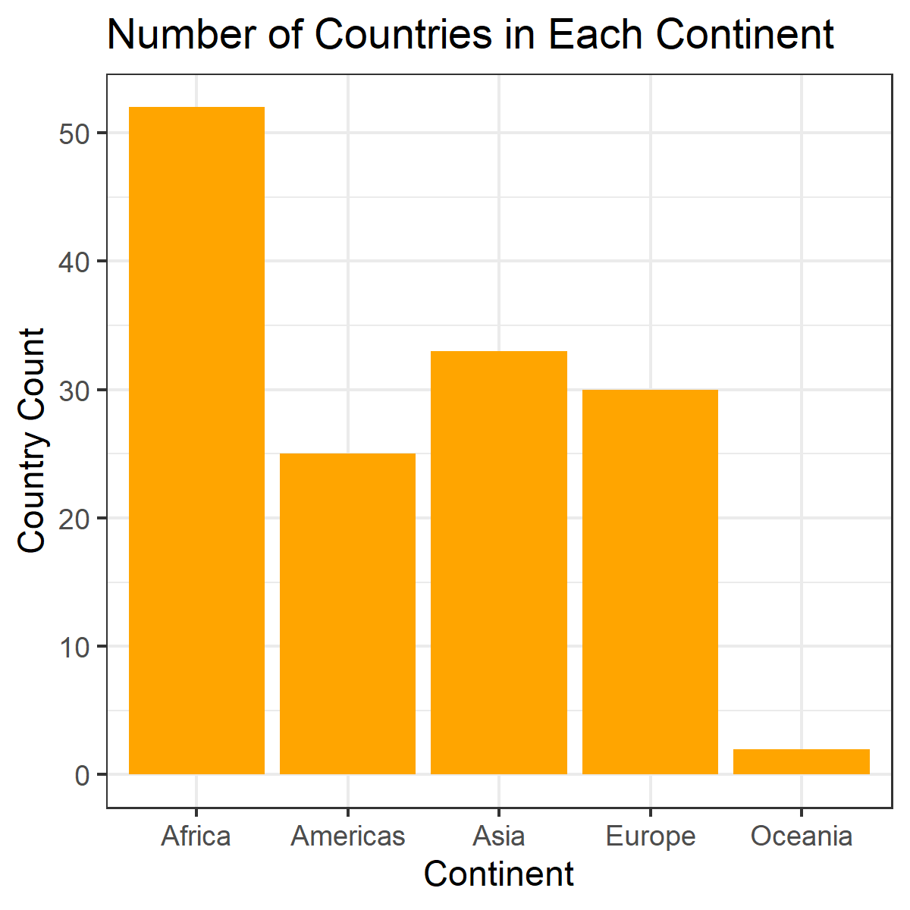
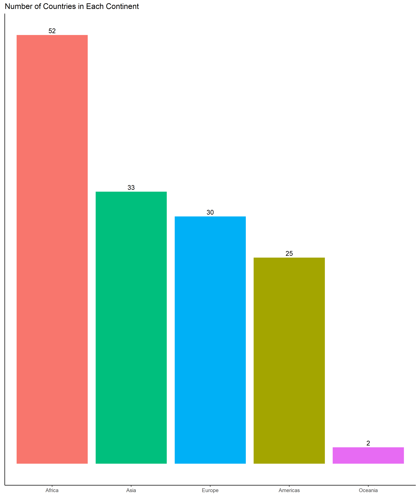

```{r setup, include=FALSE}
knitr::opts_chunk$set(echo = TRUE)
```


```{r, warning=FALSE, message=FALSE}
library(gapminder)
library(tidyverse)
library(ggplot2)
library(here)
library(dplyr)
library(forcats)
library(scales)
library(kableExtra)
library(gridExtra) # for plotting graphs side-by-side
library(grid) # for plotting graphs side-by-side
```


## **Exercise 1: Explain the Value of the ```here::here``` Package**

---------------------------------------------------------

- ```here::here``` can construct paths to your project's files. It can detect the root directory at the time when the package is loaded. This makes it easier to use sub-directories within projects because you only need to specify the path from the root to the sub-directory and not the entire path.

- Thus,```here::here``` allows other users to open and run your code from their own computer because the paths created by ```here::here``` are platform-independent. In addition, once the path has been set, ```here::here``` will work regardless of where the local copy is stored for the other person making it very robust.

## **Exercise 2: Factor Management**

-------------------------------------

```{r, warning=FALSE, message=FALSE}
str(gapminder)
```
- Using str(), we can see the data type each variable is associated with. In addition, we can see that there are 1704 rows of observations.
- Since for this task we are interested in dropping Oceania, we will focus on the continent variable. It is a factor with 5 levels. Let's look at what the 5 levels are.

```{r, warning=FALSE, message=FALSE}
levels(gapminder$continent)
```
- Using levels(), we can see the names of the 5 levels for the Continent factor. 
- Before removing Oceania, let us see how many rows of observations it contains by filtering it out and then using nrow().

```{r, warning=FALSE, message=FALSE}
gapminder %>%
  filter(continent == "Oceania") %>%
  nrow() 
```

- As shown above, Oceania contains 24 rows of observations. From this, we know we will be successful in dropping Oceania when the new data set does not contain the factor "Oceania" as well as have 24 less rows of observations. 

### **Dropping Oceania**

--------------------------------------

```{r, warning=FALSE, message=FALSE}
oceaniagone <- gapminder %>%
  filter(continent != "Oceania")

oceaniagone2 <- oceaniagone %>% # Putting this into a new variable because the drop isn't saving
                  droplevels() 
```

- I filtered out all the continents that were not Oceania and put them into a new variable called "oceaniagone."
- Next, I used the droplevels() to drop all unused levels in both country and continent.
- I put all of this into a new variable "oceaniagone2" because from my testing, the drop does not save unless I put it into a new variable.
- Now let's compare the gapminder data set to my oceaniagone2 data set.

```{r, warning=FALSE, message=FALSE}
gapminder %>%
  str()

oceaniagone2 %>%
  str() 

levels(oceaniagone2$continent)
```

- I used str() on both the original gapminder data set and the oceaniagone2 data set for comparison.
- We can see that the oceaniagone2 data set has:
  - 24 less rows of observations,
  - 2 less country levels,
  - and 1 less continent level. 
- We can also see that Oceania is gone when we use levels() on the continents of oceaniagone2. Thus, we were able to drop Oceania and all unused factor levels. 

### **Reordering the levels of ```continent```**

```{r, warning=FALSE, message=FALSE}
oceaniagone2 %>%
  mutate(continent = fct_reorder(continent, gdpPercap, min)) %>%
  ggplot(aes(continent, gdpPercap, fill = continent)) +
  geom_boxplot()+
  scale_y_log10("GDP per capita (US$)", labels = scales::dollar_format())+
  theme_bw() +
  ggtitle("Order of Continents based on Max GDP Per Cap")+
  ylab("GDP Per Capita (US$)") + xlab("Continent")
```

- I created a boxplot to evaluate the spread of GDP Per Capita within the continents of the oceaniagone2 data set.
- Here, I used the fct_reorder() to reorder the continents by the min GDP Per Cap.
- Based on the order, we can tell that Africa had the lowest min GDP Per Cap while Americas had the highest min GDP Per Cap
- We can verify this worked by producing a table with the min GDP Per Cap for the continents in the oceaniagone2 data set.

```{r, warning=FALSE, message=FALSE}
oceaniagone2 %>%
  group_by(continent) %>%
  summarize(min_gdpPercap = min(gdpPercap)) %>%
  arrange(min_gdpPercap) %>%
  kable(., format = "html", caption = 
  "Min GDP Per Capita for each Continent")%>%
  kable_styling()
```

- When we compare the order of the continents between the table and the figure above, we can see that fct_reorder() worked for the figure.
- Let's see what the order of the continents looks like when we reorder by max GDP Per Cap.

```{r, warning=FALSE, message=FALSE}
oceaniagone2 %>%
  mutate(continent = fct_reorder(continent, gdpPercap, max)) %>%
  ggplot(aes(continent, gdpPercap, fill = continent)) +
  geom_boxplot()+
  scale_y_log10("GDP per capita (US$)", labels = scales::dollar_format())+
  theme_bw() +
  ggtitle("Order of Continents based on Max GDP Per Cap")+
  ylab("GDP Per Capita (US$)") + xlab("Continent")
```

- Here, I used the fct_reorder() to reorder the continents by the max GDP Per Cap.
- Based on the order, we can tell that Africa had the lowest max GDP Per Cap and Asia had the highest max GDP Per Cap.
- To verify this, let's create a table that looks at the max GDP Per Cap for each continent in the oceaniagone2 data set.

```{r, warning=FALSE, message=FALSE}
oceaniagone2 %>%
  group_by(continent) %>%
  summarize(max_gdpPercap = max(gdpPercap)) %>%
  arrange(max_gdpPercap) %>%
  kable(., format = "html", caption = 
  "Max GDP Per Capita for each Continent")%>%
  kable_styling()
```

- The order of the continents between the table and figure are the same, verifying that fct_reorder() worked for the figure.

## **Exercise 3: File Input/Output (I/O)**

-----------------------------------------------

```{r, warning=FALSE, message=FALSE}
gap_gdppercap <- gapminder %>%
                    filter(continent == "Asia") %>%
                    group_by(country) %>%
                    summarize(mean_gdpPercap = mean(gdpPercap), digits = 2)
write_csv(gap_gdppercap, "gap_gdppercap.csv")
```

- I wrote a new .csv file that summarizes the mean GDP Per Cap for countries in Asia and put this into a variable called "gap_gdppercap". 

```{r, warning=FALSE, message=FALSE}
write_csv(gap_gdppercap, here("hw05", "Input Exercise", "exported_gap_gdppercap.csv"))
```

- I used here() to specify the path for the file. The file is now contained in the hw05 folder in a subfolder named "Input Exercise."
- To demonstrate this path works, I renamed the "gap_gdppercap.csv" file to "exported_gap_gdppercap.csv."
- Next, I am going to read the file in using read_csv().

```{r, warning=FALSE, message=FALSE}
read_csv(here("hw05", "Input Exercise", "exported_gap_gdppercap.csv")) %>%
  ggplot(., aes(mean_gdpPercap, country))+
  geom_point(color = "dark blue")+
  theme_bw()+
  scale_x_log10("GDP Per Capita (US$)", labels = scales::dollar_format())+
  ylab("Countries in Asia")+
  ggtitle("Average GDP Per Capita for Countries in Asia")
```

- I plotted GDP Per Cap versus Country and we can see that the file was read properly using read_csv() and here().
- But it is difficult to read this graph because R lists the countries in alphabetical order. 

```{r, warning=FALSE, message=FALSE}
read_csv(here("hw05", "Input Exercise", "exported_gap_gdppercap.csv")) %>%
  ggplot(., aes(mean_gdpPercap, fct_reorder(country, mean_gdpPercap)))+
  geom_point(color = "dark blue")+
  theme_bw()+
  scale_x_log10("GDP Per Capita (US$)", labels = scales::dollar_format())+
  ylab("Countries in Asia")+
  ggtitle("Average GDP Per Capita Recorded for Countries in Asia")
```

- I used fct_reorder() to reorder the countries from lowest average GDP Per Cap to highest average GDP Per Cap.
- We can see that Myanmar has the lowest average GDP Per Cap and is on the bottom of the Y-axis. In contrast, Kuwait has the highest average GDP Per Cap and is on the top of the Y-axis.  
- I can also reverse the order of the countries by making ```.desc``` = TRUE in fct_reorder().

```{r, warning=FALSE, message=FALSE}
read_csv(here("hw05", "Input Exercise", "exported_gap_gdppercap.csv")) %>%
  ggplot(., aes(mean_gdpPercap, fct_reorder(country, mean_gdpPercap, .desc = TRUE)))+
  geom_point(color = "dark blue")+
  theme_bw()+
  scale_x_log10("GDP Per Capita (US$)", labels = scales::dollar_format())+
  ylab("Countries in Asia")+
  ggtitle("Average GDP Per Capita Recorded for Countries in Asia")
```

- The Asian country with the lowest GDP Per Cap (Myanmar) is now on the top of Y-axis and the Asian country with the highest GDP Per Cap is now on the bottom of the Y-axis. 
- Overall, it appears that write_csv() and read_csv() worked. The created file survived the round trip of writing to file then reading it back in.


## **Exercise 4: Visualization Design**

-----------------------------------------------

For this exercise, I will take a figure I produced for hw02 and recreate it with effective visualization principles in mind. The figure from hw02 demonstrates the number of countries within each continent of the gapminder data set.

```{r, warning=FALSE, message=FALSE}
gapminder %>%
  group_by(continent, country) %>%
  summarize(n_countries = n_distinct(country)) %>%
  ggplot(., aes(continent, n_countries))+
  geom_col(fill = "orange")+
  ggtitle("Number of Countries in Each Continent")+
  ylab("Country Count")+
  xlab("Continent")+
  theme_bw()
```

- First, the colours for each continent are all orange. This makes it difficult to differentiate between the different continents. 
- Second, the figure has a "redundant" X-axis title. Most people will figure out that the X-axis labels are continents. Arguably, the Y-axis title can also be considered to be "redundant" since the title of the figure tells you it is showing the number of countries within each continent.
- Third, although the point of the figure is to show the number of countries within each continent, it is actually hard to determine what the number is exactly. I will now recreate the figure with effective visualization principles in mind. 

```{r, warning=FALSE, message=FALSE}
gapminder %>%
    group_by(continent, country) %>%
    summarize(n = n_distinct(country)) %>%
    tally(n) %>%
    ggplot(., aes(fct_reorder(continent, n, .desc = TRUE), n, 
    fill = continent, legend = FALSE))+
    geom_col()+
    geom_text(aes(label = n), size = 4,  vjust=-0.40)+
    ylab("")+
    xlab("")+
    ggtitle("Number of Countries in Each Continent")+
    theme(panel.grid.major = element_blank(), 
    panel.grid.minor = element_blank(),
    panel.background = element_blank(), 
    axis.line = element_line(colour = "black"),
    axis.title.y=element_blank(), 
    axis.text.y=element_blank(), 
    axis.ticks.y=element_blank(), 
    legend.position = "none") 
```

- This is the recreated figure from hw02. It looks completely different. Let's put them side-by-side for comparison.

```{r, warning=FALSE, message=FALSE}
oldplot <- gapminder %>%
              group_by(continent, country) %>%
              summarize(n_countries = n_distinct(country)) %>%
              ggplot(., aes(continent, n_countries))+
              geom_col(fill = "orange")+
              ggtitle("Number of Countries in Each Continent")+
              ylab("Country Count")+
              xlab("Continent")+
              theme_bw()

newplot <- gapminder %>%
              group_by(continent, country) %>%
              summarize(n = n_distinct(country)) %>%
              tally(n) %>%
              ggplot(., aes(fct_reorder(continent, n, .desc = TRUE), n, 
              fill = continent, legend = FALSE))+
              geom_col()+
              geom_text(aes(label = n), size = 4,  vjust=-0.40)+
              ylab("")+
              xlab("")+
              ggtitle("Number of Countries in Each Continent")+
              theme(panel.grid.major = element_blank(), 
              panel.grid.minor = element_blank(),
              panel.background = element_blank(), 
              axis.line = element_line(colour = "black"),
              axis.title.y=element_blank(), 
              axis.text.y=element_blank(), 
              axis.ticks.y=element_blank(), 
              legend.position = "none") 
              # I learned how to edit the elements of the figure from  http://www.sthda.com/english/wiki/ggplot2-themes-and-background-colors-the-3-elements

# plotting the figures side-by-side using the gridExtra package

blank<-rectGrob(gp=gpar(col="white")) # make a white spacer grob
grid.arrange(oldplot, blank, newplot, widths=c(10, 0.5, 9), ncol = 3) # code from https://stackoverflow.com/questions/31913686/how-to-align-barplots-using-grid-arrange
```

- There are many differences between the two figures that can be identified. The figure on the left is the old version and the figure on the right is the new version.
- The grid lines and redundant labels have been removed giving the new version a much simpler look.
- In the new version, each continent is now represented by it's own colour rather than sharing the same colour as the other continents.
- The number of countries within each continent is now visible in the new version. In the previous version, it was difficult to identify the exact number of countries in the continent.
- Finally, the order the continents has been reordered to go from highest number of countries to lowest number of countries in the new version giving it a much more organized look.
- Overall, using the principles of effective visualization, all these changes present  the figure in a much more attractive and impactful manner.

## **Exercise 5: Writing Figures to File**

----------------------------------------

```{r, warning=FALSE, message=FALSE}
ggsave("oldplot.png", plot = oldplot, width = 4, height = 6, scale = 1)
ggsave("newplot.png", plot = newplot, width = 5, height = 6, scale = 2) 
```
- I used ggsave to save the old and new version of the figure from hw02 into a .png.
- I played around with the width, height, and scale argument. 
- Now I am going to put the images directly onto my report using the following code ``````





